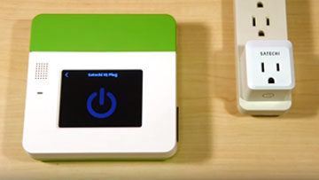
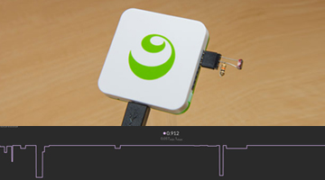
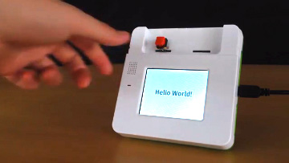
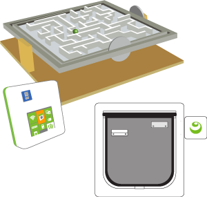

#Kinoma Tutorials and Projects

##  <a href="./basic-sensors/" style="line-height:50px;vertical-align:top;">Basic sensor tutorials

</a>

Kinoma Create and Kinoma Element support a number of hardware protocols, and these tutorials (which are also available on our website at [Kinoma Tutorials](http://kinoma.com/develop/documentation/tutorials/)) demonstrate how to interface them with specific types of sensors. Each tutorial walks through the code of a corresponding sample application. Start here to learn the basics of the supported hardware protocols and working with sensors.

			

***

##  <a href="./projects/" style="line-height:50px;vertical-align:top;"">Projects</a> 

</a> 

These more robust projects (which are also available on our website at [Kinoma Projects](http://kinoma.com/develop/documentation/projects/)) include a cat door that tracks your pet's activity, a music synthesizer, and a mechanical maze. Explanations of the code and step-by-step instructions for building the project components are provided.