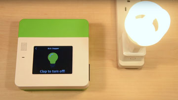
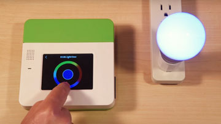
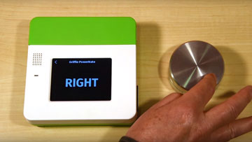
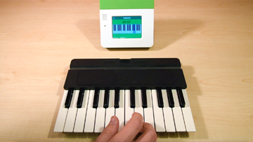
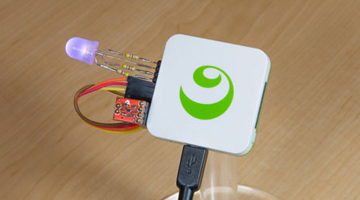

#Basic Hardware Tutorials

Kinoma Create and Kinoma Element support a number of hardware protocols. If you're new to working with hardware, you may want to start by reading the [**introductory tutorials**](./#introductory-protocol-tutorials). These provide the following:

- A description of the protocol
- Examples of sensors that use it
- A video demonstrating how to test a sensor using the Front Pins and Pin Explorer apps
- Information about the built-in BLL for the protocol
- Sample applications from our GitHub repository
- Information about how to use the Pins module to call functions in built-in/custom BLLs

If you're already familiar with hardware protocols, the [**basic sensor tutorials**](./#basic-sensor-tutorials-1) demonstrate how to interface Kinoma Create and Kinoma Element with specific types of sensors and walk through the code for a corresponding sample application.

##Introductory Protocol Tutorials

###[Audio](./audio/audio.md)

Kinoma Create has a built-in microphone and speaker (an actuator and sensor) that make it easy to incorporate sound into projects. Like other sensors, KinomaJS provides access to audio output and input through the Hardware Pins API. 

*Common uses: playing and recording sound*

###[Analog Input](./analog/analog.md)

Analog pins are only configurable as input and can receive values anywhere between 0-3.3 volts, rather than just high or low. The value is reported back in the range of 0-1, inclusive. 

*Common uses: accelerometer, variable resistor sensors*

###[Digital Input/Output](./digital/digital.md)

Digital pins can be configured for either input or output. Once configured, the pin can take on a value of high or low voltage, which is represented in code as a 1 or 0 value. 

*Common uses: blinking led, physical buttons*

###[I2C](./i2c/i2c.md)

The I²C bus is a means of communicating with more complicated sensors and (especially) breakout boards — parts that have some intelligence of their own and can speak a more complicated language. Our I²C stack supports both raw I²C communication and SMB, which is used by many modern sensor breakouts. 

*Common uses: sensor breakouts, temperature, proximity*

###[PWM](./pwm/pwm.md)

Pulse Width Modulation is the equivalent of an analog output but achieved with a digital signal. The pin will output a square wave with varied widths of high vs. low values. By taking the average of these pulses of high and low, an artificial analog voltage results between 0-3.3v. This means that in code, the pins can be set to values between 0 and 1, inclusive. 

*Common uses: servo motors, rgb led*

###[Serial](./serial/serial.md)

The Rx (receive) and Tx (send) pins are used for serial/UART communication between the Kinoma Create and other devices. Such devices communicate using a common baud rate to send data back and forth. 

*Common uses: camera, thermal printer*

###BLE

Kinoma Create version 2 includes Bluetooth Low Energy (a.k.a. BLE, Bluetooth Smart) support, allowing developers to build KinomaJS apps that connect to and control BLE peripherals. The KinomaJS BLE implementatation is provided by a built-in BLL module and accessed through the Pins module.

> No introductory KinomaJS BLE tutorial is available; see the basic sensor tutorials to learn more

***

##Basic Sensor Tutorials

> Note: These sensor tutorials only cover BLLs that run on actual devices, not simulator BLLs.

###Bluetooth LE

#### <a href="./ble-clapper/ble-clapper.md">BLE Clapper</a>

Combine the Kinoma Create with the Satechi IQ plug and build a clap on/clap off Bluetooth Low Energy controlled outlet switch.

			

***

#### <a href="./ble-colorific/ble-colorific.md">BLE Colorific Light Bulb</a>

Control the color of BLE Colorific Light Bulb using Kinoma Create's touch screen and built-in JavaScript BLE stack.

	
		
***

#### <a href="./ble-griffin-pm/ble-griffin-pm.md">Griffin Bluetooth Button</a>

Build a KinomaJS app that interfaces with the Griffin PowerMate Bluetooth Button.

		
	
***

#### <a href="./ble-miselu-keyboard/ble-keyboard.md">Miselu C.24 Keyboard</a>

Connect the Miselu Keyboard to an app on the Kinoma Create that allows you to play notes from the keyboard to the audio output on the Create.

	
		
***

#### <a href="./ble-satechi-iq-plug/ble-plug.md">Satechi IQ Plug</a>

In this example we show how to control the wireless Satechi BLE IQ Plug from Kinoma Create.

	
		
***

###Audio

#### <a href="./audio-recorder-player/audio-recorder-player.md">Audio Recorder Player</a>

Demonstrates how to record and play up to 30 seconds of audio on Kinoma Create’s built-in microphone and speaker.

	
		
***

###Analog

#### <a href="./analog-drawing-toy/analog-drawing-toy.md">Analog Drawing Toy</a>

Draw lines on the Kinoma Create screen using potentiometers, and erase your drawing with a shake gesture interpreted by an accelerometer. Uses analog input for both!

	
		
***

#### <a href="./analog-photocell-http/analog-photocell-http.md">Analog Photocell and HTTP</a>

Read an analog sensor and use the HTTPClient module to make requests to a web service.

	
		
***

#### <a href="./analog-skeleton/analog-skeleton.md"> Analog Skeleton
</a>

Stripped down app that prints a value from an analog input onto the Kinoma Create's screen. Start here to learn how to use Analog Input.

	
		
***

#### <a href="./analog-value-graph/analog-value-graph.md">Analog Value Graph</a>

Plots the reading from any analog sensor in realtime.

	
		
***

###Digital

#### <a href="./digital-in-hello-world/digital-in-hello-world.md">Digital In Hello World</a>

Uses a digital pin to read input from a physical button. When pressed, it triggers an event in the application which removes a letter from the string 'Hello World!' on the Kinoma Create's screen. Start here to learn how to use Digital Input.

	
		
***

#### <a href="./digital-out-led/digital-out-led.md">Digital Out LED</a>

Uses a digital pin to turn on and off an LED when a button is pressed on screen. Start here to learn how to use Digital Output.

	
			
***

#### <a href="./digital-light-websockets-client/digital-light-websockets-client.md">Lights On (WebSockets)</a>

A demonstration of making a companion app for a Kinoma Create project, implementing communication between an iOS app and the Kinoma Create via WebSockets. Uses Digital Output to turn an LED on and off on the Kinoma Create.

	
		
***

###I2C

#### <a href="./i2c-color-sensor/i2c-color-sensor.md">I2C Color Sensor</a>

Fills the Kinoma Create's screen with the color sensed by an RGB color sensor. Uses Digital Output to turn the color sensor's LED on and off.

***

#### <a href="./i2c-temperature/i2c-temperature.md">I2C Temperature</a>

Obtains the current temperature from an I²C temperature sensor and displays it on the Kinoma Create screen.

		
	
***

#### <a href="./i2c-temp-pwm-led/i2c-temp-pwm-led.md">I2C Temperature and PWM LED</a>

Change color of an LED based on the current temprerature.

	
		
***

###PWM

#### <a href="./pwm-continuous-servo/pwm-continuous-servo.md">PWM Continuous Servo</a>

Rotates a continuous servo using a PWM pin.

***

#### <a href="./pwm-tri-color-led/pwm-tri-color-led.md">PWM Tri-Color LED</a>

Uses red/green/blue sliders to control the color of an RGB LED. The LED is controlled by PWM pins.

***

###Serial

#### <a href="./camera/camera.md">Camera</a>

Captures and displays photographs on the screen when a button is pressed. Uses Digital Input to monitor the button.

	
		
***
