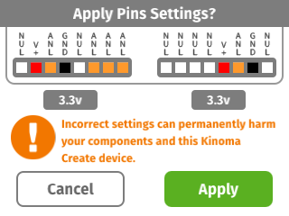
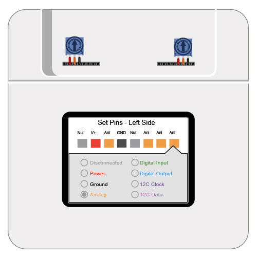
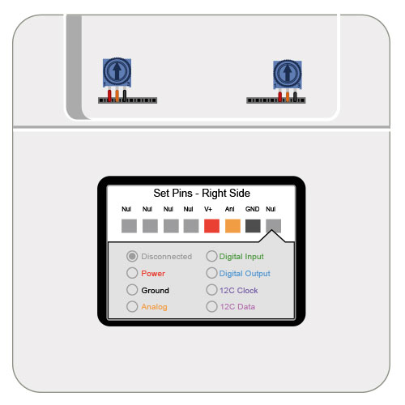
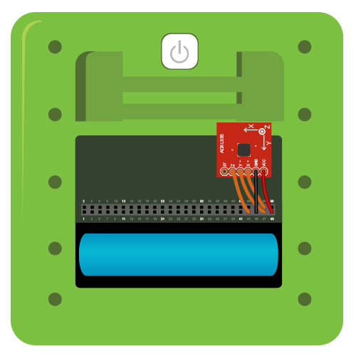
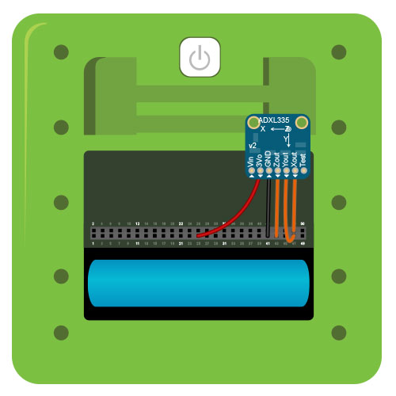
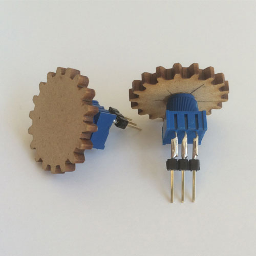

#Analog Drawing Toy

Draw lines on the Kinoma Create screen using potentiometers, and erase your drawing with a shake gesture interpreted by an accelerometer. Uses [analog input](../analog) for both!

See a video demonstration of this project [here](https://youtu.be/bO6Q-1K4klA).

<!--
<iframe width="640" height="360" src="https://www.youtube.com/embed/bO6Q-1K4klA?rel=0&amp;controls=1&amp;showinfo=0&autoplay=0" frameborder="0" allowfullscreen></iframe>
-->

##Components

* [Potentiometer](https://www.sparkfun.com/products/9806) (x2)
* [Triple Axis Accelerometer Breakout](https://www.sparkfun.com/products/9269)

##Notes

We swagged out the potentiometers by gluing laser cut gears on top of the knobs. <a href="media/gear.ai" download>Here</a> is an illustrator file of the gear we used.

We change the threshold for the shake to clear function based on the accelerometer. With the Sparkfun version, we use .005, but with the Adafruit version we use .001. Fine tune this value to adjust the application's sensitivity to shaking.

##Setup

You can mux the pins using the Front Pins app prior to running the project, but it's not necessary to do so as the application code does it for you. Figures 2 and 3 show how to mux the pins using the Front Pins app.

**Figure 1.** If you choose not to mux the pins using the Front Pins app, a confirmation dialog box will pop up on the screen of your Kinoma Create to confirm the muxing when you run the project. 



**Figure 2.** The potentiometers have three legs. The outside ones go to power and ground. The inside one goes to an analog input. Pins 56-58 are set as analog inputs so we can use them on the back.



**Figure 3.** Right header set up



**Figure 4.** The accelerometer's inputs connect to pins 43, 47, and 48, which we set to be analog inputs. Remember, these mirror pins 56-58.



**Figure 5.** The application works with both the Adafruit and Sparkfun accelerometers. Here is a wiring diagram for the Adafruit ADXL335.



**Figure 6.** We soldered the legs of the potentiometer to headers so that they would be easy to plug in and unplug. This is also advisable because sometimes the potentiometer legs fall off after some handling.



##Code Highlights

There are three files used in this application.

1. `main.js`, the application file
2. `accelerometer.js`, the BLL for the accelerometer on the back of the device
3. `potentiometers.js`, the BLL for the potentiometers on the front

###Accelerometer BLL

The accelerometer is simple; it uses 3 analog inputs to represent the change in direction in all three dimensions. The exported `read` function just returns an object with the readings of each analog input.

```
exports.pins = {
	x: { type: "Analog" },
	y: { type: "Analog" },
	z: { type: "Analog" }
};

exports.read = function() {
	return { x: this.x.read(), y: this.y.read(), z: this.z.read() };
}
```

###Potentiometer BLL

The potentiometers also use analog inputs. We use one to change the x coordinate and another to change the y coordinate. You will note that the BLL is almost identical to `accelerometer.js`.

```
exports.pins = {
	xPos: { type: "Analog" },
	yPos: { type: "Analog" }
};

exports.read = function() {
	return { xPos: this.xPos.read(), yPos: this.yPos.read() };
}
```

###Application

To adjust the threshold for the shake to clear function, see the `onDisplaying` function in `CanvasBehavior`. By default it's set to 0.001. 

```
onDisplaying(canvas) {
	...
	this.threshold = .001; 
	...
```

This is also where we configure the pins. As with all KinomaJS projects, we use the [Pins module](http://kinoma.com/develop/documentation/create-pins-module). The call to `Pins.configure` specifies that we want to use `potentiometers.js` for the potentiometers and `accelerometer.js` for the accelerometer. We also specify the pins used by each sensor.

```
Pins.configure({
	potentiometers: {
		require: "potentiometers",
		pins: {
			xPos: { pin: 64 },
			yPos: { pin: 53 },
			xground: { pin: 65, type: "Ground" },
			xpower: { pin: 63, type: "Power", voltage: 3.3 },
			yground: { pin: 54, type: "Ground" },
			ypower: { pin: 52, type: "Power", voltage: 3.3 },
		}
	},
	accelerometer: {
		require: "accelerometer",
		pins: {
			x: { pin: 57 }, 
			y: { pin: 58 }, 
			z: { pin: 56 } 
		}
	}
}, success => this.onPinsConfigured(canvas, success));
```

If the pins are successfully configured, we begin to make repeated calls to the BLLs for the potentiometers and accelerometer.

```
Pins.repeat("/potentiometers/read", 70, value => this.onPotentiometersRead(canvas, value));
Pins.repeat("/accelerometer/read", 70, value => this.onAccelerometerRead(canvas, value));
```

We keep track of the last x, y, and z readings from the accelerometer and compare them to the most recent one. If the difference between all three is greater than the specified threshold, we assume the device is being shaken and clear the canvas.

```
...
else if ((Math.abs(value.x - this.lastX) > this.threshold) && 
		 (Math.abs(value.y - this.lastY) > this.threshold)  &&
		 (Math.abs(value.z - this.lastZ) > this.threshold)) {
	this.doClear(canvas);
}
```

Meanwhile, we use the potentiometer readings to guide the line being drawn on the canvas.

```
if (this.newPoint)
	this.doMoveTo(canvas, value.xPos, value.yPos);
else
	this.doLineTo(canvas, value.xPos, 1 - value.yPos);
```

##Download

You can download the analog-drawing-toy project [here](https://github.com/Kinoma/KPR-examples/tree/master/analog-drawing-toy) or in the Samples tab of Kinoma Code.
