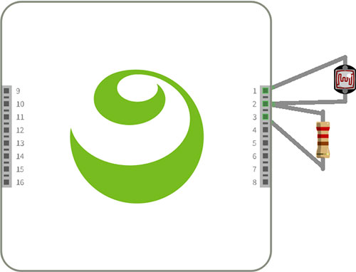
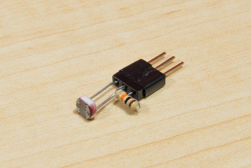
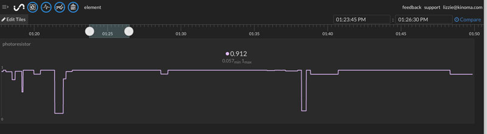
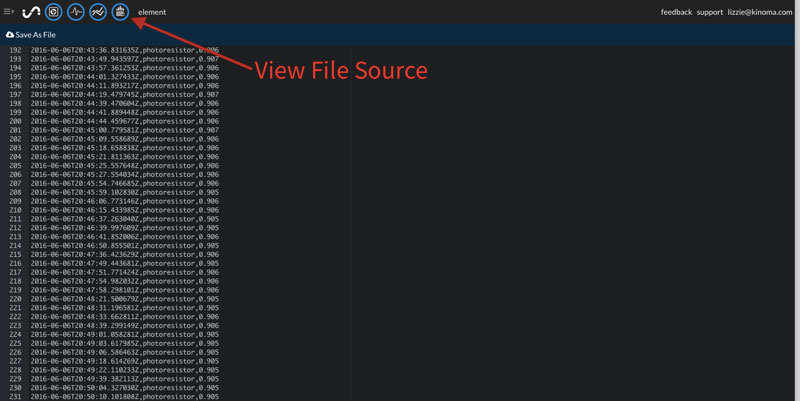

#Analog Photocell and HTTPClient

[Initial State](https://www.initialstate.com/) provides an easy to use API and graphic interface to visualize data from internet connected devices.  In this tutorial we will hook up a photoresistor to Kinoma Element and send its readings to Initial State. You will learn how to configure and read an analog sensor and use the HTTPClient module to make requests to a web service.

See a video demonstration of this project [here](https://youtu.be/qMoJ45PSy0k).

<!--
<iframe width="640" height="360" src="https://www.youtube.com/embed/qMoJ45PSy0k?rel=0&amp;controls=1&amp;showinfo=0&autoplay=0" frameborder="0" allowfullscreen></iframe>
-->

##Components

- [Mini photocell](https://www.sparkfun.com/products/9088)
- [10K resistor](https://www.sparkfun.com/products/8374)

##Wiring

The application code sets pin 1 to Power, 2 to Analog, and 3 to Ground so wire photoresistor and 10K resistor as shown below.





##Getting Started with Initial State

You'll need to register for an Initial State account [here](https://app.initialstate.com/#/register/) before you start coding. Once you're logged in, follow the steps in [this video](https://youtu.be/tGRFLe8MyuA) to create a new data bucket and set up a tile. The names of the bucket and the tile make no difference. You will, however, need to keep track of the signal key as you will use it in the application code.

<iframe width="100%" height="400" src="https://www.youtube.com/embed/tGRFLe8MyuA?rel=0&amp;vq=hd720" frameborder="0" allowfullscreen><a href="https://www.youtube.com/embed/tGRFLe8MyuA?rel=0&amp;vq=hd720">Watch Video</a></iframe>

##Customizing the Application Code

The easiest way to download any sample app is directly in [Kinoma Code](http://www.kinoma.com/develop/code) from the Samples tab.  The project name is element-initial-state. If you're not using Kinoma Code, it is available [here](https://github.com/Kinoma/KPR-examples/tree/master/element-initial-state) on GitHub.

###Adding your Keys

You'll notice that the application is short and simple--fewer than 50 lines! There are only two variables that must be edited: **BUCKET\_KEY** and **ACCESS\_KEY**.

```
let BUCKET_KEY = "YOUR_BUCKET_KEY_HERE";
let ACCESS_KEY = "YOUR_ACCESS_KEY_HERE";
```

If you didn't call your signal key 'analog' you will also need to change the definition of the **requestText** variable in the `postData` function of the application object.

```
let requestText = JSON.stringify({key: "YOUR_SIGNAL_KEY_HERE", value: value}); 
```

[This video](https://youtu.be/S4IPQulOUAk) shows how to find your keys from the Inital State tile interface and ensure your signal key matches your **requestText** key.

<!--
<iframe width="100%" height="400" src="https://www.youtube.com/embed/S4IPQulOUAk?rel=0&amp;vq=hd720" frameborder="0" allowfullscreen>
<a href="https://www.youtube.com/embed/S4IPQulOUAk?rel=0&amp;vq=hd720">Watch Video</a>
</iframe>
-->


###A Note on INTERVAL

The **INTERVAL** variable specifies how often you want data to be sent to your data bucket. The default value is 3000ms. You can make it a bit faster, but there is a limit on the number of requests you can send at a time so if you try to send several requests per second your application will likely crash.

```
let INTERVAL = 3000;
```

##Pin Configuration

The `onLaunch` function of the application object configures the photoresistor using the built-in analog [BLL](http://kinoma.com/develop/documentation/element-bll/). Upon configuration, it calls the `read` function at the interval specified by the **INTERVAL** variable, and calls the `postData` function of the application object with the sensor's value.

```
Pins.configure({
    photoresistor: {
        require: "Analog",
        pins: {
            power: { pin: 1, type: "Power" },
            analog: { pin: 2 },
            ground: { pin: 3, type: "Ground" },
        }
    },         
}, function(success) {
	if (success) 
		Pins.repeat("/photoresistor/read", INTERVAL, main.postData);
	else 
		trace("Failed to configure\n");
});
```

##HTTPClient

The `postData` function creates a new HTTPClientRequest object and sends a POST request to Initial State.

```
let request = new HTTPClientRequest(INITIALSTATE_API_URI);
request.method = "POST";
request.setHeader("Content-Type", "application/json");
let requestText = JSON.stringify({key: "analog", value: value}); 
request.setHeader("Content-Length", requestText.length);
request.start(requestText);
```

##Putting Everything Together

You are now ready to run the app! The values sent from your Kinoma Element will be displayed nicely in Initial State. The default view will look something like this:



There are a few other views as well. View File Source, for example, allows you to view the data in text form and save it as a .csv file.



##Going Further

You can easily add more sensors to your project and stream additional information to your data bucket. To learn more about programming pins, see the documentation on the [Pins Module](http://kinoma.com/develop/documentation/element-pins-module/) and [BLL programming](http://kinoma.com/develop/documentation/element-bll/) for Kinoma Element.

To send data to Initial State from multiple sensors at the same time, set **requestText** in the `postData` function to a stringified array of dictionaries, i.e.

```
let requestText = JSON.stringify([
	{ key: "photoresistor", value: photoresistorValue}, 
	{ key: "tempsensor", value: tempValue}, 
]);
```

As always, feel free to join us on our [forum](http://forum.kinoma.com/) if you need help along the way!