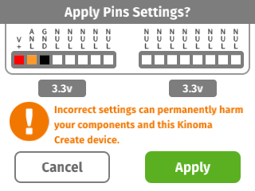

#Analog Skeleton

Stripped down app that prints a value from an [analog input](../analog) onto the Kinoma Create's screen.

See a video demonstration of this project [here](https://youtu.be/gwPsOba-ePM).

<!--
<iframe width="640" height="360" src="https://www.youtube.com/embed/gwPsOba-ePM?rel=0&amp;controls=1&amp;showinfo=0&autoplay=0" frameborder="0" allowfullscreen></iframe>
-->

##Components

* [Mini Photo cell](https://www.sparkfun.com/products/9088)
* [10k resistor](https://www.sparkfun.com/products/8374)

##Notes

This code will work with any analog sensor. As you can see, the demo video shows the code running with a flex sensor, whereas the wiring diagram shows a photoresistor. These are both variable resistor sensors and are set up with the exact same voltage divider circuit. Just make sure that your circuit matches the pin mux.

##Setup

You can mux the pins using the Front Pins app prior to running the project, but it's not necessary to do so as the application code does it for you. Figure 2 shows how to mux the pins using the Front Pins app.

**Figure 1.** If you choose not to mux the pins using the Front Pins app, a confirmation dialog box will pop up on the screen of your Kinoma Create to confirm the muxing when you run the project. 



**Figure 2.** Set pin 51 to Power, 52 to Analog, and 53 to Ground. Then wire photoresistor and 10k resistor as shown.


##Code Highlights

The code for this project is very short. It consists of just one file, `main.js`. 

The UI is minimal; it is simply a `Container` object with a `Label` inside. The string of the label will be changed with each reading of the analog sensor. You can read more about `Container` and `Label` objects in our [Containment Hierarchy tutorial](http://kinoma.com/develop/documentation/kinomajs-tutorials/containment-hierarchy/).

```
var MainContainer = Container.template($ => ({ 
	left: 0, right: 0, top: 0, bottom: 0, 
	skin: new Skin({ fill: 'white',}), 
	contents: [
		Label($, { 
			left: 0, right: 0, 
			style: new Style({ color: 'black', font: '46px' }), 
			behavior: Behavior({
				onAnalogValueChanged: function(content, result) {
					content.string = result;
				},
			}),
			string: '- - -', 
		}),
	]
}));
```

As with all KinomaJS projects, we use the [Pins module](http://kinoma.com/develop/documentation/create-pins-module/) to interact with the sensor. The call to `Pins.configure` specifies that we want to use `Analog.js`, the [built-in analog BLL](https://github.com/Kinoma/kinomajs/blob/master/kinoma/kpr/projects/create/shell/device/Analog.js) and the pins it uses.

```
Pins.configure({
    analogSensor: {
        require: "Analog",
        pins: {
            power: { pin: 51, type: "Power", voltage: 3.3 },
            analog: { pin: 52 },
            ground: { pin: 53, type: "Ground" }
        }
    }
}, ...
```
If the configuration is successful, we begin to poll the sensor every 20ms. We then `distribute` the value we received from the sensor to all content objects in the containment hierarchy of the application (our `MainContainer` instance, in this case). You can read more about the `distribute` function and `Behavior` objects in our [Application Logic in Behaviors tutorial](http://kinoma.com/develop/documentation/kinomajs-tutorials/behaviors/).

```
success => {
    if (success) {
    	Pins.repeat("/analogSensor/read", 20, result => {
    		application.distribute( "onAnalogValueChanged", result );
    	})
    } else {
    	trace("Failed to configure pins.\n");
	}
```

##Download

You can download the analog-starter project [here](https://github.com/Kinoma/KPR-examples/tree/master/analog-starter) or in the Samples tab of Kinoma Code.
