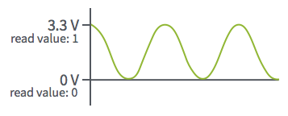
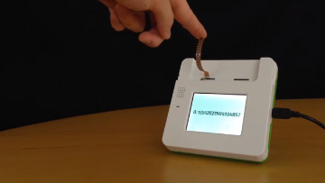
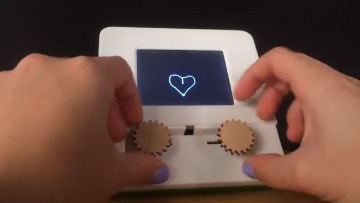
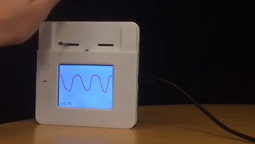

#Analog

Analog pins are only configurable as input. They can receive values anywhere between 0V and the configured voltage of the front pins (3.3V or 5V), as opposed to digital pins which can only be high or low. The value of an analog pin is reported back in the range of 0-1, inclusive.



###Examples of Analog Sensors

- [Potentiometer](https://www.adafruit.com/products/356)
- [Photo cell](https://www.adafruit.com/products/161)
- [Flex sensor](https://www.adafruit.com/products/1070) 

###Configuration

Like digital sensors, analog sensors are very easy to use. Although the example sensors mentioned above may be used in very different projects, their configuration and the code to interact with them is the same.

[This video](https://youtu.be/HUBXKKEtTHM) shows a potentiometer and a photo cell being configured through the Front Pins app and the visualization of their readings in the Pin Explorer app.

<!--
<iframe width="100%" height="500" src="https://www.youtube.com/embed/HUBXKKEtTHM?rel=0&amp;vq=hd1080" frameborder="0" allowfullscreen></iframe>
-->

###Programming Analog Pins

####BLL

`Analog.js`, the built-in analog BLL, contains just three functions:

1. `configure`: initializes the pin connection
2. `read`: returns the sensor's current value as a value between 0 and 1, inclusive
3. `close`: closes the pin connection

Here is the full source code of `Analog.js`. It's short, but often enough for a simple analog sensor like the examples from the section above.

```
//@module
exports.pins = {
	analog: { type: "Analog" }
};
	
exports.configure = function() {
    this.analog.init();
}
	
exports.close = function() {
	this.analog.close()
}
	
exports.read = function() {
    return this.analog.read();
}
```
	
Some projects may call for more than a simple read function. For these you will need to create a custom BLL. For example, the [Analog Drawing Toy sample](https://github.com/Kinoma/KPR-examples/tree/master/analog-drawing-toy/device) incorporates two analog potentiometers. Rather than using the built-in BLL for each one separately, we created a [custom BLL](https://github.com/Kinoma/KPR-examples/blob/master/analog-drawing-toy/device/potentiometers.js) that configures both and extended the `read` function to return the value of both in a JSON object.

```
exports.read = function() {
    return { xPos: this.xPos.read(), yPos: this.yPos.read() };
}
```

####Interacting with the BLL from your Application

The application file (`main.js` in all of our samples) is where you will configure the sensor and call the `read` function or other custom functions in its BLL. This is most easily done using the [Pins module](http://kinoma.com/develop/documentation/create-pins-module/).

```
var Pins = require("pins");
Pins.configure({
	analogSensor: {
		require: "BLL-NAME-HERE", //"Analog" if using the built-in BLL
    	pins: {
     		analog: { pin: 54 }
    	}
  	}
}, success => {
	if (success) {
		Pins.repeat("/analogSensor/read", 20, result => {
			// do something with result
		});
	}
});
```

###Basic Sensor Tutorials

####[Analog Skeleton](../analog-skeleton/analog-skeleton.md)



Stripped down app that prints a value from an analog input onto the Kinoma Create's screen. Start here to learn how to use Analog Input.

####[Drawing Toy](../analog-drawing-toy/analog-drawing-toy.md)



Draw lines on the Kinoma Create screen using potentiometers, and erase your drawing with a shake gesture interpreted by an accelerometer. Uses analog input for both!

####[Analog Value Graph](../analog-value-graph/analog-value-graph.md)



Plots the reading from any analog sensor in realtime.

###Project Tutorials

####[Camera Trap](../../projects/camera-trap/camera-trap-160616a-CR.md)


Break a laser beam, get caught by the Kinoma Create-controlled camera.