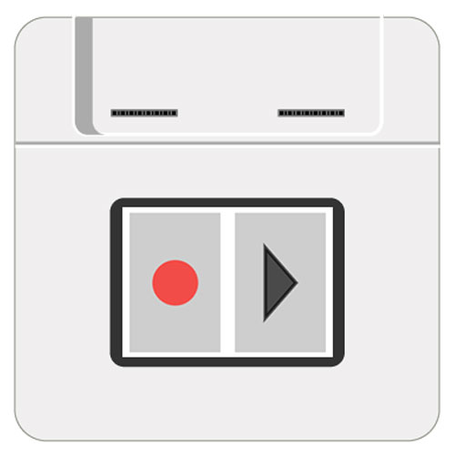

#Audio Recorder Player

Demonstrates how to record and play up to 30 seconds of audio using Kinoma Create’s [built-in microphone and speaker](../audio).

See a video demonstration of this project [here](https://youtu.be/f3MC-JYgt-k).

<!--
<iframe width="640" height="360" src="https://www.youtube.com/embed/f3MC-JYgt-k?rel=0&amp;controls=1&amp;showinfo=0&autoplay=0" frameborder="0" allowfullscreen></iframe>
-->

##Setup

**Figure 1.** No hardware wiring is needed for this sample.
 


##Code Highlights

There are three files used in this application.

1. `main.js`, the application file
2. `audioBLL.js`, the BLL for the speaker and microphone
3. `buttons.js`, a module that contains all the logic related to the record/play buttons


###Audio BLL

The basic steps to record and playback audio on Kinoma Create are as follows:

1. Start the microphone
2. Wait for some length of time
3. Stop the microphone
3. Read the audio input as a Chunk
4. Write the Chunk to the speaker
5. Start the speaker 

In this application all of the steps are contained in four functions--`startRecording`, `stopRecording`, `playRecording`, and `stopPlay`--to simplify the application logic in `main.js`.

```
exports.startRecording = function(){
	this.microphone.start();
	this.speaker.stop();
}

exports.stopRecording = function(){
	this.microphone.stop();	
	soundBite = {};
	soundBite.content = this.microphone.read();
	soundBite.duration = (soundBite.content.byteLength / 2) / sampleRate;
	return( soundBite.duration );
}

exports.playRecording = function(){
	if ( soundBite.content ){
		this.speaker.write( soundBite.content );
		this.speaker.start();
	}
}

exports.stopPlay = function(){
	this.speaker.stop();
}
```

###Application

When the application is launched, we use the [Pins module](http://kinoma.com/develop/documentation/create-pins-module/) to interact with the speaker and microphone. The call to `Pins.configure` specifies that we want to use the `audioBLL.js` module. If the configuration is successful, we add an instance of the `MainScreen` template to the application.

```
Pins.configure({
	sounds: {
		require: "audioBLL",
		pins: {
			microphone: { sampleRate: 8000, channels: 1 },
			speaker: { sampleRate: 8000, channels: 1 }
		}
	},
}, success => {
	if (success)	
		application.add( new MainScreen() );
	else
		trace("Failed to configure pins.\n");
});
```

The `MainScreen` template contains our record and play buttons. `RecordButtonBehavior` and `PlayButtonBehavior` are defined in `buttons.js` (discussed in the next section) and imported at the top of the application file. When tapped, they call the functions in `audioBLL.js`.

```
let MainScreen = Container.template($ => ({
	left:0, right:0, top:0, bottom:0, skin:backgroundSkin,
	contents: [
		Line($, {
			left:10, right:10, top:10, bottom:10,
			contents: [
				Canvas($, {
					left:10, right:10, top:10, bottom:10, active:true,
					Behavior: class extends RecordButtonBehavior {
						onButtonTouchBegan(canvas) {
						  Pins.invoke("/sounds/startRecording");
						}
						onButtonTouchEnded(canvas) {
						  Pins.invoke("/sounds/stopRecording", runTime => canvas.delegate("onRecordingComplete", runTime));
						}
					}
				}),
				Canvas($, {
					left:10, right:10, top:10, bottom:10, active:true,
					Behavior: class extends PlayButtonBehavior {
						onButtonTouchBegan(canvas) {
						  Pins.invoke("/sounds/stopPlay");
						  Pins.invoke("/sounds/playRecording");
						}
					}
				}),
			]
		})
	]
}));
```

###Buttons module

The on-screen buttons are `Canvas` objects. You can read all about `Canvas` objects in the [KinomaJS JavaScript reference](http://kinoma.com/develop/documentation/javascript/), but all you really need to know is that `Canvas`  objects let you draw using the HTML 2D Canvas API specified by the W3C.

The circle and triangle you see on screen are the result of the `draw` functions in `PlayButtonBehavior` and `RecordButtonBehavior`.  For example, here is the portion of the`draw` function of `PlayButtonBehavior` that uses the Canvas API to draw a triangle.

```
draw( canvas, pressed ) {
	var ctx = canvas.getContext( "2d" );
	var w = canvas.width;
	var h = canvas.height;	
	...
	ctx.clearRect( 0, 0, w, h );
    ctx.fillRect( 0, 0, w, h );
    ctx.fillStyle = fillStyle;
    ctx.strokeStyle = fillStyle;
    ctx.lineWidth = 5;
	ctx.beginPath();
	ctx.moveTo( w / 3, h / 4 )
	ctx.lineTo( w / 3, ( 3 * h ) / 4  );
	ctx.lineTo( ( 2 * w ) / 3, h / 2 );
	ctx.lineTo( w / 3, h / 4 )
    ctx.stroke();
    ctx.fill();
}
```

##Download

You can download the audio-recorder-player project [here](https://github.com/Kinoma/KPR-examples/tree/master/audio-recorder-player) or in the Samples tab of Kinoma Code.