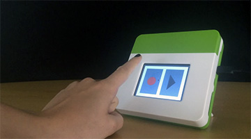

#Audio

Kinoma Create has a built-in microphone and speaker (an actuator and sensor) that make it easy to incorporate sound into projects. Like other sensors, KinomaJS provides access to audio output and input through the Hardware Pins API.

The microphone can only be accessed using the audio input hardware pin. The speaker can be used to play audio using three methods, which are all covered in [this tech note](http://kinoma.com/develop/documentation/technotes/playing-audio-kinomajs/). Only the audio output hardware pin is covered in this document.

###Programming Audio Input/Output

####Using the built-in audio BLL

`Audio.js`, the built-in audio BLL, contains the following functions:

1. `configure`: initializes the connection to the speaker  or microphone
2. `read`: reads all available audio input, and returns it in a Chunk
3. `write`: writes chunk to queue for audio output
4. `start`: begins playback (output) or recording (input)
5. `stop`: ends playback (output) or recording (input)
6. `setVolume`: sets the volume level of an audio output to a value from 0 to 1.0
6. `close`: closes the connection to the speaker or microphone

Here is the full source code of `Audio.js`. There's not much to it, but it's enough to record and playback audio clips.

```
//@module

exports.pins = {
	audio: {type: "Audio"}
}

exports.configure = function() {
	this.audio.init();
}

exports.close = function() {
	this.audio.close();
}

exports.read = function() {
	return this.audio.read();
}

exports.write = function(chunk) {
	this.audio.write(chunk);
}

exports.start = function() {
	this.audio.start();
}

exports.stop = function() {
	this.audio.stop();
}

exports.setVolume = function(value) {
	this.audio.setVolume(value);
}
```

The easiest way to interact with BLLs is using the [Pins module](http://kinoma.com/develop/documentation/create-pins-module/) in your application file (`main.js` in all of our samples). 

The basic steps to record and playback audio using the built-in `Audio.js` are as follows:

1. Start the microphone
2. Wait for some length of time
3. Stop the microphone
3. Read the audio input as a Chunk
4. Write the Chunk to the speaker
5. Start the speaker 

A sample application that records sound for three seconds and immediately plays it back is provided below. The screen will be white while recording, and turn green once it starts playing the audio back.

The speaker and microphone both use `Audio.js`, but the directions specified in their corresponding pins objects are different--"input" for the microphone, "output" for the speaker. This sample also uses a [`handler`](http://kinoma.com/develop/documentation/kinomajs-tutorials/flow/#interacting-with-web-services-asynchronously-handlers) to pause between the calls to `microphone.start` and `microphone.stop`.

```
let Pins = require("pins")

let recordingSkin = new Skin({ fill: "white" });
let playingSkin = new Skin({ fill: "green" });

Handler.bind("/waitThenPlay", {
    onInvoke: function(handler, message){
        handler.wait(message.requestObject);
    },
    onComplete: function(handler, message) {
    	application.skin = playingSkin;
        Pins.invoke("/microphone/stop")
        Pins.invoke("/microphone/read", chunk => {
        	if (chunk) {
        		Pins.invoke("/speaker/write", chunk);
        		Pins.invoke("/speaker/start");
        	};
        });
    }
});

application.behavior = Behavior({
	onLaunch:function(application) {
		Pins.configure({
			speaker: { type: "Audio", direction: "output", sampleRate:8000, channels: 1},
			microphone: { type: "Audio", direction: "input", sampleRate:8000, channels: 1},
		}, success => {
			if (success) {
				application.skin =recordingSkin;
				Pins.invoke("/speaker/setVolume", 1);
				Pins.invoke("/microphone/start");
				new MessageWithObject("/waitThenPlay", 3000).invoke(); // Invokes handler and tells it to wait 3000ms before playing sound back
			}	
		});
	}
});
```

####Using a custom audio BLL

Some projects may call for more than the simple functions provided in the built-in `Audio.js`. For these you will need to create a custom BLL. A good example of this is the [audio-detect sample app](https://github.com/Kinoma/KPR-examples/tree/master/audio-detect), which records audio samples and displays the peak and average sample levels in realtime on the screen. It uses a custom `read` function that returns an analysis of the sound content rather than the sound content itself.

```
exports.read = function() {
    var buffer = this.audio.read();
	var samples = new Int16Array(buffer)
    var count = samples.length;
    var total = 0, peak = 0, rms = 0.1;
    for (var i = 0; i < count; i += 1) {
        var sample = samples[i];
        if (sample & 0x8000)
        	sample |= 0xFFFF0000;
        if (sample < 0)
            sample = -sample;

        total += sample;
        rms += sample * sample;

        if (peak < sample)
            peak = sample;
    }

    return { count: count, peak: peak, average: Math.round(total / count), rms: Math.round(Math.sqrt(rms / count))};
}
```

As with built-in BLLs, the easiest way to interact with a custom BLL is using the [Pins module](http://kinoma.com/develop/documentation/create-pins-module/) in your application fie (`main.js` in all of our samples).

```
var Pins = require("pins");
Pins.configure({
	microphone: {
		require: "BLL-NAME-HERE",
    	pins: {
     		audio: { direction: "input" }
    	}
  	},
}, success => {
	if (success) {
		Pins.invoke("/microphone/read", data => {
			// do stuff with returned data
		});
	}
});
```

###Basic Sensor Tutorials

####[Audio Recorder Player](../audio-recorder-player/audio-recorder-player.md)



Demonstrates how to record and play up to 30 seconds of audio on Kinoma Create’s built-in microphone and speaker.