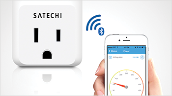
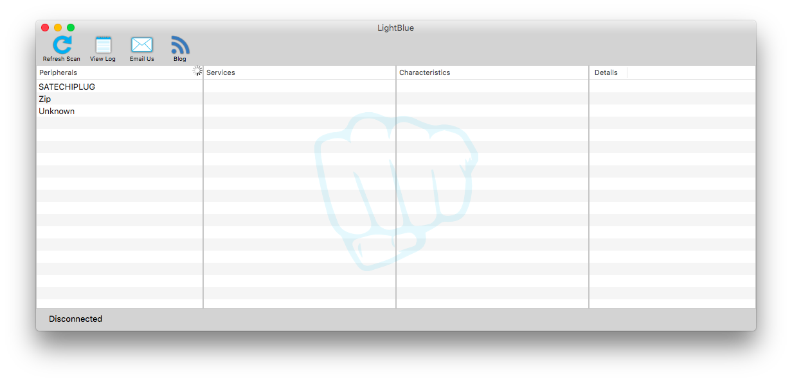
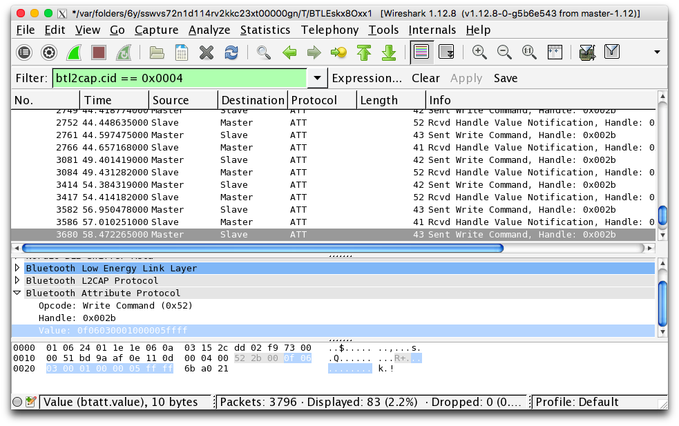
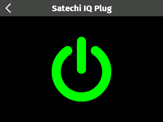

#Bluetooth Low Energy (LE) Tutorial - Controlling the Satechi IQ Plug

See a video demonstration of this project [here](https://youtu.be/Z3SacY0MZqQ).

<!--
<iframe width="640" height="360" src="https://www.youtube.com/embed/Z3SacY0MZqQ?rel=0&amp;controls=1&amp;showinfo=0&autoplay=0" frameborder="0" allowfullscreen></iframe>
-->

Bluetooth Low Energy (a.k.a. BLE, Bluetooth Smart) is a wireless technology designed to support a wide variety of IoT peripherals. The low energy requirement allows BLE peripherals to operate for long periods of time on a coin cell battery. It isn't uncommon for a BLE peripheral to operate for a year or more without having to change the battery. Popular BLE peripherals include the FitBit, personal heart rate monitors and key finders. This short [overview](https://www.bluetooth.com/what-is-bluetooth-technology/bluetooth-technology-basics/low-energy) by the Bluetooth SIG provides additional background.

Kinoma Create version 2 includes BLE support, allowing developers to build [KinomaJS](http://kinoma.com/develop/documentation/overview) apps that connect to and control BLE peripherals. The KinomaJS BLE implementatation is provided by a built-in [BLL](http://kinoma.com/develop/documentation/pins/) module and accessed through the [Pins module](http://kinoma.com/develop/documentation/create-pins-module). 

In this example we show how to control the wireless [Satechi BLE IQ Plug](http://www.satechi.net/index.php/iq-plug) from Kinoma Create. 

**Figure 1.**



##Configuration

Applications incorporating BLE must first configure and initialize the associated BLL before using any BLE services.

```
Pins.configure({
	ble: {
		require: "/lowpan/ble"
	}
}, success => this.onPinsConfigured(application, success));
```

The application assigns the unique name ```ble``` to the BLE BLL and uses that name in subsequent calls to the library. ```Pins.configure``` returns a Boolean ```success``` result. We pass this result to the ```onPinsConfigured``` function to complete initialization.

```
onPinsConfigured(application, success) {
	if (success) {
		Pins.when("ble", "notification", this.onBLENotification);
		application.add(new MainScreen(this.data));
	}
	else {
		throw new Error("Unable to configure BLE");
	}
}
```

Assuming the BLE library configured successfully, the application  completes it's initialization by providing a BLE notification callback. The callback is triggered by the BLE module to deliver the application BLE notifications. ```Pins.when``` is used here to provide the callback. Lastly the application displays the main screen UI. All KinomaJS BLE apps follow this same configuration and initialization sequence.

##BLE notifications

BLE is asynchronous, which means that responses corresponding to application requests are not immediately delivered. Instead the KinomaJS BLE stack communicates with the BLE app via notifications delivered to the notification callback provided by the application.

```
onBLENotification(response) {
	let notification = response.notification;
	if ("gap/connect" == notification) {
		let peripheral = response;
		application.distribute("onPeripheralConnected", peripheral);
	}
	else if ("gap/disconnect" == notification) {
		let connection = response.connection;
		application.distribute("onPeripheralDisconnected", connection);
	}
	else if ("gap/discover" == notification) {
		let peripheral = response;
		application.distribute("onPeripheralDiscovered", peripheral);
	}
}
```
The ```response``` parameter always includes a ```notification``` property string, which describes the type of notification delivered. The notifications are defined by the BLE module. The callback distributes the BLE notification response to the application for processing. In this example the application is driven by three BLE notifications:

* The `gap/discover` notification response provides information about perhipherals discovered by the BLE module. BLE peripherals typically advertise an abbreviated product name, which is often included in this reponse and allows applications to identify specific peripheral devices.
* The `gap/connect` notification response is delivered when an application successfully establishes a connection to a BLE peripheral. A connection is required to control the peripheral.
* The `gap/disconnect` notification response is delivered when a peripheral disconnects from the application.

In the following sections we'll take a closer look at how these notifications are used by BLE applications.

##Discovering peripherals

BLE peripherals advertise their presence by broadcasting advertising packets. A BLE peripheral is either powered off, advertising or connected to a BLE host app (a.k.a. BLE central).

In order to discover BLE peripherals, KinomaJS applications must first start BLE scanning.

```
Pins.invoke("/ble/gapStartScanning");
```

GAP is an acronym for the BLE *Generic Access Profile*, which is used to manage peripheral discovery and connections. The ```gapStartScanning``` call initiates scanning. When scanning, `gap/discover` notifications corresponding to peripheral advertisements are delivered to the app.

This application is only interested in connecting to the IQ Plug. As noted earlier, peripherals commonly advertise their short model name. There are many BLE apps available for desktop and mobile platforms that allow developers to browse advertising peripherals. We often use [LightBlue](https://itunes.apple.com/us/app/lightblue/id639944780?mt=12) on Mac OS.

**Figure 2.** 



In the peripherals column we see that the IQ Plug is advertised as "SATECHIPLUG." With this knowledge the app can identify the IQ plug from the `gap/discover` notification response.

```
onPeripheralDiscovered(container, peripheral) {
	let scanResponseData = peripheral.data;
	for (let i = 0, c = scanResponseData.length; i < c; ++i) {
		let entry = scanResponseData[i];
		if (0x09 == entry.flag && 'SATECHIPLUG' == entry.data) {
			this.doConnect(container, peripheral);
			return;
		}
	}
}
```

This notification response provides an Array of scan response entry packets corresponding to the GAP [Advertising Data Type](https://www.bluetooth.org/en-us/specification/assigned-numbers/generic-access-profile) and data definitions. The application matches the IQ Plug by name and connects to the IQ Plug peripheral.

##Connecting to peripherals

Once the desired peripheral is discovered, the application requests a connection to the peripheral.

```
doConnect(container, peripheral) {
	Pins.invoke("/ble/gapConnect", { address:peripheral.address, addressType:peripheral.addressType });
}
```

The ```peer``` property included in the discovered ```peripheral``` object is passed to ```gapConnect``` to request a connection to the IQ Plug peripheral.

The connection response includes a connection *handle* which is used to control the peripheral. The application saves a reference to the connection handle.

```
onPeripheralConnected(container, peripheral) {
	if (null == this.connection) {
		this.connection = peripheral.connection;
	}
}
```

##Controlling peripherals

BLE peripherals are typically controlled by writing data to their characteristic or attribute handles. [BLE characteristics](https://developer.bluetooth.org/gatt/characteristics/Pages/CharacteristicsHome.aspx) are essentially collections of data within [BLE services](https://developer.bluetooth.org/gatt/services/Pages/ServicesHome.aspx). Services are included by [BLE profiles](https://developer.bluetooth.org/gatt/profiles/Pages/ProfilesHome.aspx). 

In order to interact with a BLE peripheral, the host application needs to know the format of the attribute data. Unfortunately not all BLE manufacturers publish the peripheral's data format, as is the case with Satechi. So in order to control the plug we used Adafruit's [Bluefruit LE Sniffer](https://www.adafruit.com/product/2269) along with an [OS X client](http://sourceforge.net/p/nrfblesnifferosx/wiki/ble_sniffer/) to capture the BLE packets to [Wireshark](https://www.wireshark.org/) while controlling the IQ Plug from Satechi's mobile app. Adafruit provides a nice [tutorial](https://learn.adafruit.com/reverse-engineering-a-bluetooth-low-energy-light-bulb/sniff-protocol) on how to sniff BLE packets.

While capturing packets we used the mobile app to turn the plug on and off and found the commands (data format) in the Wireshark capture.

**Figure 3.** 



The [Generic Attribute Profile](https://www.bluetooth.com/specifications/assigned-numbers/generic-attribute-profile) is used to exchange data over a BLE connection using the Attribute Protocol (ATT). The highlighted transaction shows the command sent from the BLE master (mobile app) to the BLE slave (IQ Plug) to turn on the plug. Attributes are written to via their *handle* and the IQ Plug attribute handle ```0x002b``` controls the plug.

The application calls the ```gattWriteCharacteristicValue``` function to turn the plug on and off when tapping the switch graphic on the Kinoma Create screen.

**Figure 4.** 



```
...
let data = {
	off_command: [0x0F, 0x06, 0x03, 0x00, 0x00, 0x00, 0x00, 0x04, 0xFF, 0xFF],
	on_command: [0x0F, 0x06, 0x03, 0x00, 0x01, 0x00, 0x00, 0x05, 0xFF, 0xFF],
};
...

onSwitchStateChange(container, state) {
	let command = ("on" == state ? this.data.on_command : this.data.off_command);
	let params = {
		connection: this.connection,
		characteristic: 0x002b,
		value: command
	}
	Pins.invoke("/ble/gattWriteCharacteristicValue", params);
}
```

##Wrapping up

When the peripheral disconnects, the `gap/disconnect` notification is delivered, allowing the application to return back to the peripheral scanning state.

```
onPeripheralDisconnected(container, connection) {
	this.connection = null;
	this.doScan(container);
}
```

##Sample app

The complete sample app is available [here](https://github.com/Kinoma/KPR-examples/tree/master/ble-satechi-iqplug) on GitHub.