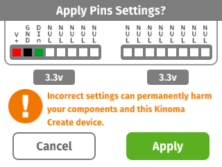
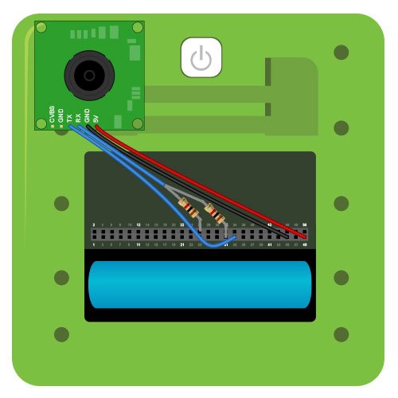
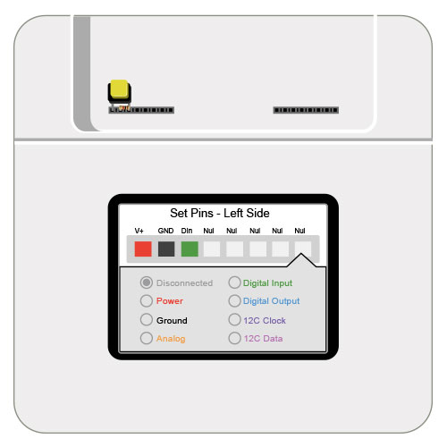
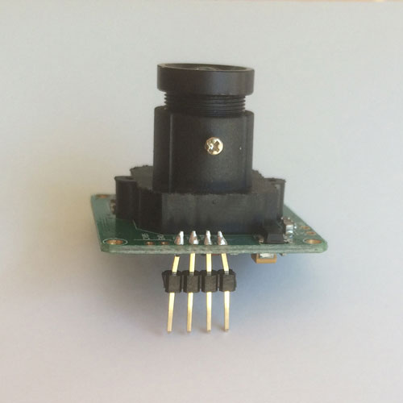
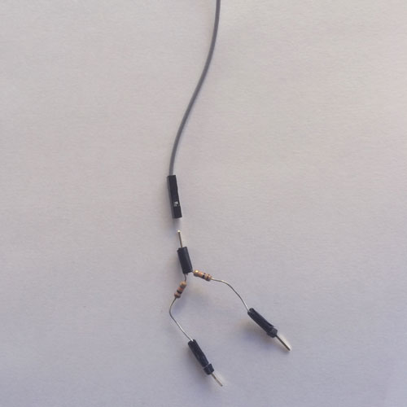

#Serial Camera

Captures and displays photographs on the screen when a button is pressed. Demonstrates the use of [serial](../serial) and [digital](../digital) sensors.

See a video demonstration of this project [here](https://youtu.be/QBZ21McbHjM).

<!--
<iframe width="640" height="360" src="https://www.youtube.com/embed/QBZ21McbHjM?rel=0&amp;controls=1&amp;showinfo=0&autoplay=0" frameborder="0" allowfullscreen></iframe>
-->

##Components

* [TTL Serial JPEG Camera](https://www.adafruit.com/product/397)
* [Momentary Push Button](https://www.sparkfun.com/products/9190)
* [10k resistor](https://www.sparkfun.com/products/8374)

##Notes

Though the pin is labeled 5V, the camera functions properly on 3.3V. Because the Kinoma Create is a 3.3V system, you should use 3.3V power instead of 5V or you risk damaging your I2C bus.

##Setup

You can mux the pins using the Front Pins app prior to running the project, but it's not necessary to do so as the application code does it for you. Figures 3 shows how to mux the pins using the Front Pins app.

**Figure 1.** If you choose not to mux the pins using the Front Pins app, a confirmation dialog box will pop up on the screen of your Kinoma Create to confirm the muxing when you run the project. 



**Figure 2.** The serial camera is wired to 3.3v power, ground, Rx, and Tx. The Rx pin needs a pull-down resistor connected to ground.



**Figure 3.** The button can be wired to the front connector using power, a digital input, and a resistor to pull the button down to ground when not pressed.



**Figure 4.** The pins on the camera are closer than the standard spacing on our board (.1 inches), so we bent our headers to convert the interval.



**Figure 5.** In order to do some aerial breadboarding, we soldered a male header to a node with two resistors, and male headers to each of the resistors to make them easy to plug into the Kinoma Create.



##Code Highlights

There are two files used in this application.

1. `main.js`, the application file
2. `VC0706.js`, the BLL for the camera

###Application

####Defining the UI

The `Skin` objects defined at the top are used to change the color of the screen to make the application's status clear.

```
let flashSkin = new Skin({ fill: 'white' });
let defaultSkin = new Skin({ fill: 'green' });
let failureSkin = new Skin({ fill: 'red' });
```

The behavior of the `MainContainer` template contains the code to change the background color depending on the current state. The `onButtonTouchBegan` function, which is called while the button is being held down, hides the image (if any) and switches the container's skin to `flashSkin`. The `onButtonTouchEnded` function calls the `capture` function in the camera's BLL and loads the image data into the `Picture` object in the container's contents.

```
let MainContainer = Container.template($ => ({ 
	left: 0, right: 0, top: 0, bottom: 0, 
	behavior: Behavior({
		...
		onButtonTouchBegan: function(container, message, chunk) {
			//hide the previous image and display flash 	
	     	container.image.visible = false;
	     	container.skin = flashSkin;
		},
		onButtonTouchEnded: function(container, message, chunk) {
			//ask for a new image to come back (comes as a chunk)s
	     	Pins.invoke( "/camera/capture", chunk => {
				//display the image
				if ( chunk == false ){
				    container.distribute( "onHardwareFailure" );
				}
				container.image.visible = true;           
				container.image.load( chunk );
	     	});
	     	container.skin = defaultSkin;
		},
	}),
	contents: [
		Picture($, { left: 0, right: 0, top: 0, bottom: 0, name: 'image' }),
	]
}));

```

####Application set up

`Layer` objects are special types of containers that allow you to transform content in various ways. You can read more about `Layers` in [this tutorial](../../kinomajs-tutorials/layers/) and in the [KinomaJS JavaScript reference](http://kinoma.com/develop/documentation/javascript/). The `onLaunch` function in this application's behavior begins by adding an instance of our `MainContainer` template to a `layer` and rotating it since the camera is flipped upside down.

```
application.behavior = Behavior({
	onLaunch: function(application) {
		let layer = new Layer( { width: 320, height: 240 } );
        layer.origin = { x: 160, y: 120 };
        let mainContainer = new MainContainer();
        layer.add( mainContainer ); 
        if( flipImage ){
        	layer.rotation = 180;
        } else {
            layer.rotation = 0; 
        }
        application.add( layer ); 
...
```

We then use the [Pins module](http://kinoma.com/develop/documentation/create-pins-module) to interact with the sensors. The call to `Pins.configure` specifies that we want to use `VC0706.js` for the camera and `Digital.js`, the [built-in digital BLL](https://github.com/Kinoma/kinomajs/blob/master/kinoma/kpr/projects/create/shell/device/Digital.js) for the button. We also specify the pins each sensor uses.

```
Pins.configure({
	camera: {
		require: "VC0706",
		pins: {
			serial: { rx: 33, tx: 31 }
		}
	},  
	button: {
		require: "Digital",
		pins: {
			power: { pin: 51, type: "Power", voltage: 3.3 },
        	ground: { pin: 52, type: "Ground" },
			digital: { pin: 53, direction: "input" }
		}
	}
},...
```

Once configured, we read the button every 70ms. When it's pressed we use the `distribute` function to trigger the events in the `MainContainer` object. You can read more about the `distribute` function in our [Application Logic in Behaviors tutorial](http://kinoma.com/develop/documentation/kinomajs-tutorials/behaviors/).

```
let prevButtonState = false;
Pins.repeat( "/button/read", 70, buttonState => {
	if ( !prevButtonState && buttonState ) {
		application.distribute( "onButtonTouchBegan" ); 
	} else if ( prevButtonState && !buttonState ) {
		application.distribute( "onButtonTouchEnded" ); 
	}
	prevButtonState = buttonState;
});
```

###Camera BLL

The BLL for the camera is based on the sensor's [data sheet](http://www.adafruit.com/datasheets/VC0706protocol.pdf). You can read more about building BLLs based on data sheets in [this tutorial](../../kinomajs-tutorials/building-a-bll/), but in this tutorial we're only going to look at the `capture` function for this particular BLL.

As you can read in [this overview document](https://learn.adafruit.com/ttl-serial-camera/overview), this camera module was originally designed for video surveillance purposes. It's therefore meant to stream video, but can be used to capture images as well by freezing the video temporarily and downloading a JPEG of the current frame. Therefore, the first step to capture the current image is to stop the camera from updating the frame by sending FBUF_CTRL as defined in the data sheet.

```
exports.capture = function() {
   ...
   try{
		sendCommand( this.serial, FBUF_CTRL, [0x1, STOPCURRENTFRAME], 5 );
	}
	catch( error ){
		return false; 
	}
```

We then read the image data and put it in a `Chunk`.

```	
	...
	var len = getFrameBufferLength( this.serial );
	if( len > 0 ) {
	    var readlen = 64;
	    var bytesLeft = len;
        var buffer = null;
        
        chunk = new Chunk();
	    while( bytesLeft > 0 ){
	        var bytesToRead = Math.min( readlen, bytesLeft );
	        var frameptr = len - bytesLeft;
			try{
				 buffer = sendCommand( this.serial, READ_FBUF, [0x0C, 0, 0x0A,
	                                0, 0, frameptr >> 8, frameptr & 0xFF,
	                                0, 0, 0, bytesToRead,
	                                0, 0], 5 + bytesToRead + 5 );
			}
			catch( error ){
				return false; 
			}
	        chunk.append( buffer.slice( 5, bytesToRead + 5 ) );
	        buffer.free()
	        bytesLeft -= bytesToRead;
	    }
	}
	...
```

Then we resume the frame by sending FBUF_CTRL and return the chunk of image data.

```
    try{
		 sendCommand( this.serial, FBUF_CTRL, [ 0x1,0x03 ], 5 ); 
	}
	catch( error ){
		return false; 
	}
	return chunk;
}
```

##Download

You can download the serial-camera project [here](https://github.com/Kinoma/KPR-examples/tree/master/serial-camera) or in the Samples tab of Kinoma Code.