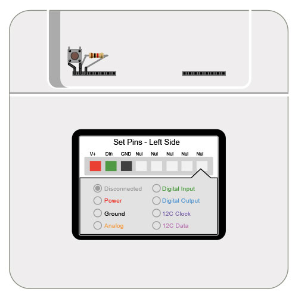

#Digital In Hello World

Uses a [digital](../digital) pin to read input from a physical button. When pressed, it triggers an event in the application which removes a letter from the string 'Hello World!' on the Kinoma Create's screen.

See a video demonstration of this project [here](https://youtu.be/nS6fHzDeVZA).

<!--
<iframe width="640" height="360" src="https://www.youtube.com/embed/nS6fHzDeVZA?rel=0&amp;controls=1&amp;showinfo=0&autoplay=0" frameborder="0" allowfullscreen></iframe>
-->

##Components

* [Momentary Push Button](https://www.sparkfun.com/products/9190)
* [10k resistor](https://www.sparkfun.com/products/8374)

##Notes

The 10k resistor between the digital input leg of the button and ground is called a 'pull-down resistor.' It is necessary to keep the digital input from getting random noise while the button is in its un-pressed, disconnected state.

##Setup

You can mux the pins using the Front Pins app prior to running the project, but it's not necessary to do so as the application code does it for you. Figures 2 shows how to mux the pins using the Front Pins app.

**Figure 1.** If you choose not to mux the pins using the Front Pins app, a confirmation dialog box will pop up on the screen of your Kinoma Create to confirm the muxing when you run the project. 


**Figure 2.** Set pins 51-53 to Power, Digital In, and Ground. The button goes to 51 and 52, while the 'Digital In' leg of the button gets tied to pin 53's ground with a 10k resistor.



##Code Highlights

There are two files used in this application.

1. `main.js`, the application file
2. `button.js`, the BLL for the button

###Button BLL

The button BLL exports a `wasPressed` function that compares the current state of the button to the previous state. If the signal goes from low to high, it means the button was pressed and it returns true.

```
exports.wasPressed = function() {
	var formerState = this.state;
	this.state = this.button.read();
	return ((formerState == 0) && (this.state == 1));
}
```

###Application

####UI

The application file `main.js` defines the UI and configures the pins. Here we create a template for a `Container` object that contains a `Label`. The string of the label changes whenever the `clicked` function of the container's behavior is invoked. We then add an instance to the application's containment hierarchy in the `onLaunch` function of the application's behavior.

```
let MainContainer = Container.template($ => ({ 
	left: 0, right: 0, top: 0, bottom: 0, 
	skin: MainSkin, 
	behavior: Behavior({
		clicked: function(container) {
			//When button clicked, remove letter from label's string.
           	let curString = container.first.string;
	        if ( curString.length == 0 ) {
            	container.first.string = "Hello World!"
            } else {
            	container.first.string = curString.substring( 0, curString.length - 1 );
           	}
		},
	}),
	contents: [
		Label($, { left: 0, right: 0, top: 0, bottom: 0, style: ButtonStyle, string: 'Hello World!' }),
	]
}));

...

application.behavior = Behavior({
	onLaunch: function(application) {
		application.add( new MainContainer );
		...
	}
});
```

You can read more about defining user interfaces in our [Containment Hierarchy tutorial](http://kinoma.com/develop/documentation/kinomajs-tutorials/containment-hierarchy/), and more about behaviors in our [Application Logic In Behaviors tutorial](http://kinoma.com/develop/documentation/kinomajs-tutorials/behaviors/).

####Pin configuration

As with all KinomaJS projects, we use the [Pins module](http://kinoma.com/develop/documentation/create-pins-module/) to interact with the sensor. The call to `Pins.configure` specifies that we want to use the BLL `button.js`  and the pins it uses.

```
Pins.configure({
	button: {
        require: "button",
        pins: {
        	power: { pin: 51, type: "Power", voltage: 3.3 },
        	ground: { pin: 52, type: "Ground" },
            button: { pin: 53},
        }
    }
}, ...
```
If the configuration is successful, we begin to call the buttons `wasPressed` function every 20ms. If it returns true, the application calls the `clicked` function of each content object it contains (the instance of `MainContainer`, in this case).
	
```
Pins.repeat("/button/wasPressed", 20, result => {
	if ( result == true ) application.distribute( "clicked" );
});
```

##Download

You can download the digital-in-hello-world project [here](https://github.com/Kinoma/KPR-examples/tree/master/digital-in-hello-world ) or in the Samples tab of Kinoma Code.