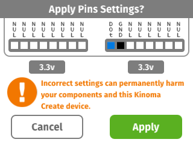
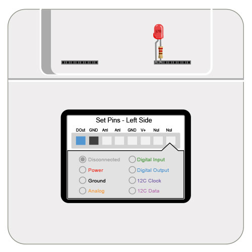
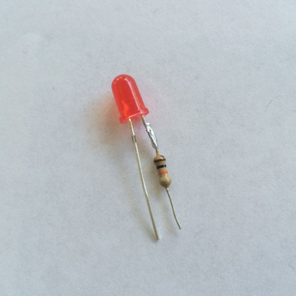

#Digital Out LED

Uses an on-screen button to turn on and off a [digital](../digital) LED.

See a video demonstration of this project [here](https://youtu.be/sIExJD1Tj94).

<!--
<iframe width="640" height="360" src="https://www.youtube.com/embed/sIExJD1Tj94?rel=0&amp;controls=1&amp;showinfo=0&autoplay=0" frameborder="0" allowfullscreen></iframe>
-->

##Components

* [Basic LED](https://www.sparkfun.com/products/9590)
* [330 ohm resistor](https://www.sparkfun.com/products/8377)

##Notes

We soldered the resistor between the LED and ground for a stable connection. If you’re in a hurry or looking for a temporary setup, you can wind the resistor around the LED’s leg and wrap them together with electrical tape.

##Setup

You can mux the pins using the Front Pins app prior to running the project, but it's not necessary to do so as the application code does it for you. Figure 2 shows how to mux the pins using the Front Pins app.

**Figure 1.** If you choose not to mux the pins using the Front Pins app, a confirmation dialog box will pop up on the screen of your Kinoma Create to confirm the muxing when you run the project. 



**Figure 2.** Connect the long leg of the LED to the digital output pin and the other leg to a resistor leading to ground.



**Figure 3.** We soldered the resistor directly to the short leg of the LED and trimmed the legs to be the same length so that it would be easy to plug in.



##Code Highlights

There are two files used in this application.

1. `main.js`, the application file
2. `led.js`, the BLL for the LED

###LED BLL

The BLL is very simple. It contains two custom functions, `turnOn` and `turnOff` that are called by the application whenever the on-screen button is pressed.

```
exports.turnOn = function() {
    this.led.write(	1 );
}
		
exports.turnOff = function() {
    this.led.write( 0 );
}
```

###Application

You can customize the color and text style of the background and button by changing the `Skins` and `Style` at the beginning of the code. You can read more about these in the [KinomaJS JavaScript Reference](../../javascript/) or the [Containment Hierarchy tutorial](http://kinoma.com/develop/documentation/kinomajs-tutorials/containment-hierarchy/).

You'll note that `MainSkin` only has a single fill color, but `ButtonSkin` has an array containing two colors. `MainSkin` is used by the `MainContainer` template, which fills the background and contains the button. The first item in the array of `ButtonSkin` is the color of the button when the state of its container is 0; the second item is the color of the button when the state of its container is 1.

```
let MainSkin = new Skin({ fill: '#F0F0F0',});
let ButtonSkin = new Skin({ fill: ['#707070', '#4E4E4E']});
let ButtonStyle = new Style({ color: 'white', font: 'bold 50px Helvetica, sans-serif' });
```
The state of the button is changed in the `onTouchBegan` and `onTouchEnded` functions in its behavior. `onTouchBegan` and `onTouchEnded` are built-in functions that can be used in any KinomaJS application for a device with a touch screen. You can read more about them in our [Application Logic in Behaviors tutorial](http://kinoma.com/develop/documentation/kinomajs-tutorials/behaviors/). 

```
onTouchBegan: function(container, id, x, y, ticks) {
	container.state = 1;
	...
},
onTouchEnded: function(container, id, x, y, ticks) {
	container.state = 0;
},
```

The `onTouchBegan` function also calls the `turnOn` and `turnOff` functions in the LED's BLL, changes the string in the button, and keeps track of the LED's current state.

```
onTouchBegan: function(container, id, x, y, ticks) {
	...
	let currState = this.ledState;
    if ( currState ) {
		Pins.invoke("/light/turnOff");	               
		container.first.string = "turn on";
	} else {
		Pins.invoke("/light/turnOn");	 
		container.first.string = "turn off";
	}
    this.ledState = !currState;
}
```

When the application is launched, we configure the pins using the [Pins module](http://kinoma.com/develop/documentation/create-pins-module). The call to `Pins.configure`specifies that we want to use `led.js` and the pins it uses. If the configuration is successful, we add an instance of the `MainContainer` template to the screen.

```
application.behavior = Behavior({
	onLaunch: function(application) {
		Pins.configure({
		    light: {
		        require: "led",
		        pins: {
		        	ground: { pin: 60, type: "Ground" },
		            led: { pin: 59 }
		        }
		    }
		}, success => {
			if (success) {
        		application.add( new MainContainer() );
			}
		});
	}
});
```

##Download

You can download the digital-out-led project [here](https://github.com/Kinoma/KPR-examples/tree/master/digital-out-led) or in the Samples tab of Kinoma Code.