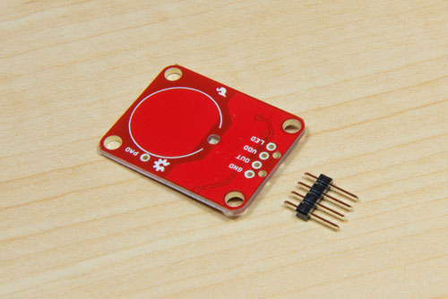
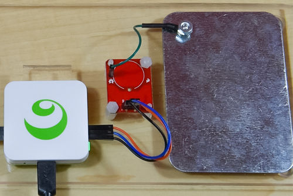
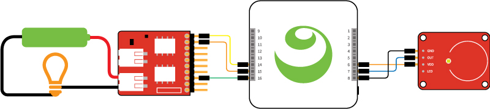

#Digital Relay and Capacitive Touch Sensor

Kinoma Element can interface with many off-the-shelf 3.3V sensors, but sometimes projects call for the use of devices that have much greater power requirements. Relays are electrically operated switches that allow you to switch much higher voltages and currents than Kinoma Element can on its own. In this tutorial you'll learn how to control a digital output relay made by [Tessel](https://tessel.io/) with a digital input capacitive touch sensor.

See a video demonstration of this project [here](https://youtu.be/UxEYCdmDIXQ).

<!--
<iframe width='100%' height='400' src="https://www.youtube.com/embed/UxEYCdmDIXQ?rel=0&amp;vq=hd720" frameborder="0" allowfullscreen></iframe>
-->

###Materials

- [Tessel Relay](https://www.seeedstudio.com/item_detail.html?p_id=2309)
- [Capacitive Touch Breakout](https://www.sparkfun.com/products/12041)
- [Pin Headers](https://www.sparkfun.com/products/116)
- [M2F Jumper Wires](https://www.sparkfun.com/products/12794)

###Wiring

Both the capacitive touch sensor and relay have power, ground, and digital wires. The relay comes with pin headers attached, but you'll need to solder your own onto the touch sensor.



Attaching a pin header to the PAD pin on the capacitive touch sensor will allow you to create your own external electrode, but it is not required. We attached it to a metal plate, but any conductive item can be used. You might, for example, attach it to a plant, a banana, a sculpture made of [conductive dough](http://courseweb.stthomas.edu/apthomas/SquishyCircuits/conductiveDough.htm), or a [conductive paint](https://www.adafruit.com/products/1306) mural.



The application code specifies the pin mapping. It is important that the physical wiring match the code. The touch sensor's mapping is as follows:

- Power (VDD): 6
- Ground (GND): 8
- Digital (OUT): 7

The temperature sensor's mapping is as follows:

- Power (3.3V): 14
- Ground (GND): 15
- Digital (TX/G1): 16



###Code

Digital sensors are very easy to use. We're using two in this project and the code is short and sweet--fewer than 40 lines of JavaScript!

####Pin Configuration

Kinoma Element applications use JavaScript modules called [BLLs](http://kinoma.com/develop/documentation/element-bll/) to communicate with sensors. The [Pins module](http://kinoma.com/develop/documentation/element-pins-module/) is used to make calls to BLLs from the main application file. Users can define custom BLLs as necessary, but built-in BLLs for each hardware protocol are included in the Pins module and are often enough for simple projects.

In this project we use the [built-in digital BLL](https://github.com/Kinoma/kinomajs/blob/master/xs6/sources/mc/extensions/pins/bll_Digital.js) for both the capacitive touch sensor and relay. We do so by requiring the "Digital" module and specifying the direction (input or output) of each in their respective pin objects passed into `Pins.configure`.

```
Pins.configure({
	touchSensor: {
		require: "Digital",
		pins:{
			power: {pin: 6, type: "Power"},
			ground: {pin: 8, type: "Ground"},
			digital: {pin: 7, direction: "input"},
		}
	},
	relay: {
		require: "Digital",
		pins:{
			power: {pin: 14, type: "Power"},
			ground: {pin: 15, type: "Ground"},
			digital: {pin:16, direction: "ouput"},	
		}
	},
}
...
```	

####Reading and Writing
	
Once configured, we begin to read the capacitive touch sensor every 100ms. If the previous reading was high and the current reading is low, we know the sensor has been tapped and we toggle the relay on or off.

```	
Pins.repeat("/touchSensor/read", 100, result => {
	if ((prevState == 1) && (result == 0)) {
		ledState = !ledState;
		Pins.invoke("/relay/write", ledState);
	}
	prevState = result;
});
```

###Going Further

In the demo video at the top of this page we have our relay hooked up to a small battery-powered light, but you can easily attach it to other high-powered things. For example, we've also used an extended version of this project to make our own touch lamps. You can see a video demonstration of the lamp project [here](https://youtu.be/MntEvaT5JYM).

<!--
<iframe width='100%' height='400' src="https://www.youtube.com/embed/MntEvaT5JYM?rel=0&amp;vq=hd720" frameborder="0" allowfullscreen></iframe>
-->

See [this forum post](https://forums.tessel.io/t/can-i-use-the-relay-module-for-xyz/337) on Tessel's website for more information on what you can plug into your relay.


###Sample App 

The easiest way to download any sample app is directly in [Kinoma Code](http://www.kinoma.com/develop/code) from the Samples tab.  The project name is element-touch-relay. If you're not using Kinoma Code, it is available [here](https://github.com/Kinoma/KPR-examples/tree/master/element-touch-relay) on GitHub.