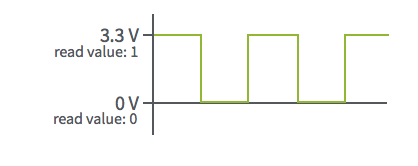
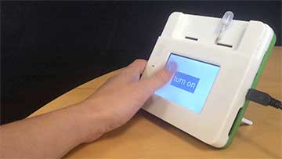
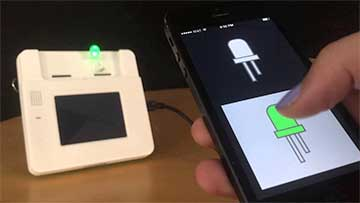

#Digital

Digital pins can be configured for either input or output. Once configured, the pin can take on a value of high or low voltage, which can be thought of conceptually as a 1 or 0 value. 

On Kinoma Element and the back pins of Kinoma Create, high values are 3.3V. On the front pins of Kinoma Create, high values are whatever voltage the front header has been set to (3.3V or 5V).



###Examples of Digital Input

- [Buttons](https://www.adafruit.com/products/1010)
- [Capacitive touch breakout](https://www.sparkfun.com/products/12041)
- [IR break beam receivers](https://www.adafruit.com/products/2167?gclid=CMHgwI7r1MsCFZNgfgodXrkA0Q) 

###Examples of Digital Output

- [Basic LEDs](https://www.sparkfun.com/products/531)
- [Tessel relay](http://www.seeedstudio.com/depot/Tessel-Relay-Module-p-2309.html) 

###Configuration

Digital sensors are very easy to use. Although sensors that use digital input from buttons, capacitive touch sensors, and IR break beams may be used in very different projects, their configuration and the code to interact with them is the same. The same is true for sensors that use digital output.

[This video](https://youtu.be/gs375yAVqKA) shows a button and a capacitive touch sensor being configured through the Front Pins app and the visualization of their readings in the Pin Explorer app.

<!--
<iframe width="100%" height="500" src="https://www.youtube.com/embed/gs375yAVqKA?rel=0&amp;vq=hd1080" frameborder="0" allowfullscreen></iframe>
-->

Digital output pins can also be configured through the Front Pins app and controlled in the Pin Explorer app with 3 different controls, as shown in the [this video](https://youtu.be/YlrSwrHCNMg).

<!--
<iframe width="100%" height="500" src="https://www.youtube.com/embed/YlrSwrHCNMg?rel=0&amp;vq=hd1080" frameborder="0" allowfullscreen></iframe>
-->

###Programming Digital Input Pins

####BLL

`Digital.js`, the built-in digital BLL, contains functions for digital input and digital output pins. For digital input, the relevant ones are:

1. `configure`: initializes the pin connection
2. `read`: returns the sensor's current value (0 or 1)
3. `close`: closes the pin connection

The relevant code is shown below. It's short, but often enough for a simple digital input sensor like the examples from the section above.

```
//@module
exports.pins = {
	digital: {type: "Digital"}
}
	
exports.configure = function() {
	this.digital.init();
}
	
exports.close = function() {
	this.digital.close();
}
	
exports.read = function() {
	return this.digital.read();
}
```

Some projects may call for more than a simple read function. For these you will need to create a custom BLL. For example, in several of our sample apps that use buttons and capacitive touch sensors the state of the sensor is saved to make it easy to add a `wasPressed` function. You can see this in [`button.js`](https://github.com/Kinoma/KPR-examples/blob/master/digital-in-hello-world/device/button.js) of the [digital-in-hello-world sample](https://github.com/Kinoma/KPR-examples/tree/master/digital-in-hello-world).

```
exports.configure = function() {
	this.button.init();
	this.state = -1;
}
	
exports.read = function() {
	this.state = this.button.read();
	return this.state;
}
	
exports.wasPressed = function() {
	var formerState = this.state;
	this.state = this.button.read();
	return ((formerState == 0) && (this.state == 1));
}
```
	
####Interacting with the BLL from your Application
	
The application file (`main.js` in all of our samples) is where you will configure the sensor and call the `read` function or other custom functions in its BLL. This is most easily done using the [Pins module](http://kinoma.com/develop/documentation/create-pins-module/).

```
var Pins = require("pins");
Pins.configure({
	digitalSensor: {
		require: "BLL-NAME-HERE", //"Digital" if using the built-in BLL
    	pins: {
     		digital: { pin: 54, direction: "input" }
    	}
  	}
}, success => {
	if (success) {
		Pins.repeat("/digitalSensor/read", 20, result => {
			// do something with result
		});
	}
});
```
	
###Programming Digital Ouput Pins

####BLL

As mentioned above, digital output pins can also use the built-in `Digital.js` BLL. For digital output, the relevant functions are:

1. `configure`: initializes the pin connection
2. `write`: writes the given value (should be 0 or 1) to the pin
3. `close`: closes the pin connection

The code for these functions is shown below. It's short, but often enough for a simple digital output sensor like the examples from the section above.

```
//@module
exports.pins = {
	digital: {type: "Digital"}
}
	
exports.configure = function() {
	this.digital.init();
}
	
exports.close = function() {
	this.digital.close();
}
	
exports.write = function(value) {
	return this.digital.write(value);
}
```
	
Again, some projects may call for custom functions and therefore custom BLLs. 

Perhaps instead of a `write` function that takes in an argument, you want to have separate `turnOn` and `turnOff` functions as seen in [`led.js`](https://github.com/Kinoma/KPR-examples/blob/master/digital-light-websockets-server/device/led.js) from the [digital-light-websockets-server example](https://github.com/Kinoma/KPR-examples/tree/master/digital-light-websockets-server)

```
exports.turnOn = function() {
    this.digital.write( 1 );
}
	
exports.turnOff = function() {
    this.digital.write( 0 );
}
```

Or maybe you want to create a `blink` function that automatically toggles a light on and off for a few seconds.

```
exports.blink = function() {
	for ( var i = 0; i < 5; i++ ) {
		this.digital.write( 1 );
		sensorUtils.mdelay( 500 ); //waits 500ms
		this.digital.write( 0 );
		sensorUtils.mdelay( 500 ); //waits 500ms
	}
}
```
	
####Interacting with the BLL from your Application
	
As always, the application can then use the [Pins module](http://kinoma.com/develop/documentation/create-pins-module/) to configure the sensor and call the exported functions in its BLL.

```
var Pins = require("pins");
Pins.configure({
	digitalSensor: {
		require: "BLL-NAME-HERE", //"Digital"  if using the built-in BLL
    	pins: {
     		digital: { pin: 54, direction: "output" }
    	}
  	}
}, success => {
	if (success) {
		Pins.invoke("/digitalSensor/write", 1);
		//or Pins.invoke("/digitalSensor/turnOn");
		//or Pins.invoke("/digitalSensor/blink");
	}
});
```

###Basic Sensor Tutorials

####[Digital In Hello World](../digital-in-hello-world/digital-in-hello-world.md)


Uses a digital pin to read input from a physical button. When pressed, it triggers an event in the application which removes a letter from the string 'Hello World!' on the Kinoma Create's screen. Start here to learn how to use Digital Input.

####[Digital Out LED](../digital-out-led/digital-out-led.md)



Uses a digital pin to turn on and off an LED when a button is pressed on screen. Start here to learn how to use Digital Output.

####[Camera](../camera/camera.md)


Captures and displays photographs on the screen when a button is pressed. Uses Digital Input to monitor the button.

####[Color Sensor](../i2c-color-sensor/i2c-color-sensor.md)


Fills the Kinoma Create's screen with the color sensed by an RGB color sensor. Uses Digital Output to turn the color sensor's LED on and off.

####[Lights On (Websockets)](../digital-light-websockets-client/digital-light-websockets-client.md)



A demonstration of making a companion app for a Kinoma Create project, implementing communication between an iOS app and the Kinoma Create via websockets. Uses Digital Output to turn an LED on and off on the Kinoma Create.

###Project Tutorials

####[Ringer](../../projects/ringer/ringer-160616a-CR.md)


We built a Indiegogo monitor that rings a bell everytime a new person supports our campaign and purchases a Kinoma Create device. You can download the open source project now and run in the Kinoma Studio Simulator.
