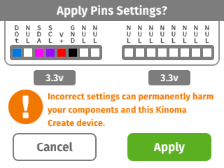
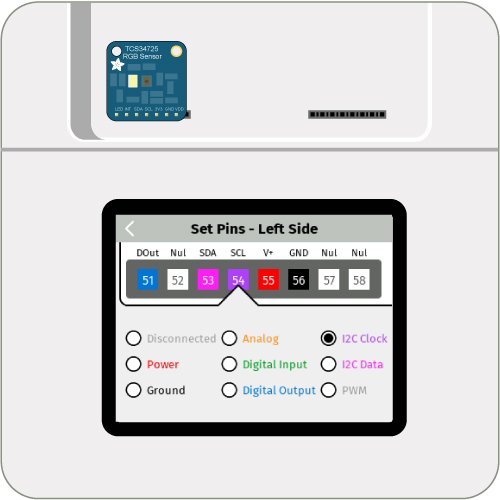

<!-- Note to self: Change video (moved sensor to front pins)  -->

#I²C Color Sensor

Fills the Kinoma Create's screen with the color sensed by an [I2C](../i2c) RGB color sensor.

See a video demonstration of this project [here](https://youtu.be/loNEz-Z06ys).

<!--
<iframe width="640" height="360" src="https://www.youtube.com/embed/loNEz-Z06ys?rel=0&amp;controls=1&amp;showinfo=0&autoplay=0" frameborder="0" allowfullscreen></iframe>
-->

##Components

* [RGB Color Sensor](https://www.adafruit.com/products/1334)

##Notes

The color sensor works best with its LED turned on and when held very close to the subject to be measured. Bright colors give the most interesting results.

##Setup

You can mux the pins using the Front Pins app prior to running the project, but it's not necessary to do so as the application code does it for you. Figure 2 shows how to mux the pins using the Front Pins app.

**Figure 1.** If you choose not to mux the pins using the Front Pins app, a confirmation dialog box will pop up on the screen of your Kinoma Create to confirm the muxing when you run the project. 



**Figure 2.** The sensor's I²C pins should be connected directly to those on the Kinoma Create. The LED pin on the sensor should go to a Digital pin on the Kinoma Create.



##Code Highlights

There are two files used in this application.

1. `main.js`, the application file
2. `TCS34725.js`, the BLL for the RGB color sensor

A walkthrough tutorial of how `TCS34725.js` was written can be found in this [Building a BLL tutorial](http://kinoma.com/develop/documentation/kinomajs-tutorials/building-a-bll/). A brief overview is provided below.

###Color Sensor BLL

It is often the case that the `configure` function of a BLL simply calls each pins' `init` function. This BLL's `configure` function also sends a command to the power-on register, sets the gain and integration time, and turns on the LED built into the sensor.

```
exports.configure = function(configuration) {
	this.rgb.init();
	var id = this.rgb.readByteDataSMB( COMMAND | ID );
	if (0x44 != id)
		throw "colorSensor - cannot find device - got ID " + id;
	this.rgb.writeByteDataSMB( COMMAND | ENABLE, ENABLE_PON );
	sensorUtils.mdelay( 3 );
	this.rgb.writeByteDataSMB( COMMAND | ENABLE, ENABLE_PON | ENABLE_AEN );

    this.setGain( configuration.pins.rgb.gain );
    this.setIntegrationTime( configuration.pins.rgb.integrationTime );

    if ( "led" in this ) {
        this.led.init();
        this.setLED( configuration.pins.led.value );
    }
}
```

The `getColor` function converts data from the sensor into RGB color values and returns them in an object, along with the raw data.

```
exports.getColor = function() {
	var r = this.rgb.readWordDataSMB( COMMAND | RDATAL );
	var g = this.rgb.readWordDataSMB( COMMAND | GDATAL );
	var b = this.rgb.readWordDataSMB( COMMAND | BDATAL );
	var c = this.rgb.readWordDataSMB( COMMAND | CDATAL );
	return {
		raw: { r: r, g: g, b: b, c: c },
		r: Math.round( ( r / c ) * 255 ),
		g: Math.round( ( g / c ) * 255 ),
		b: Math.round( ( b / c ) * 255 )
	};
}
```

###Application

The `onLaunch` function of the application's behavior is where we configure the pins. As with all KinomaJS projects, we use the [Pins module](../../create-pins-module/) to interact with the sensor. The call to `Pins.configure` specifies that we want to use the BLL `TCS34725.js`  and the pins it uses.

```
Pins.configure({
	colorSensor: {
		require: "TCS34725",
			pins: {
				rgb: { sda: 53, clock: 54 },
				led: { pin: 51 },
				power: { pin: 55, type: "Power", voltage: 3.3 },
				ground: { pin: 56, type: "Ground" }
		}
	}
}, ...
```	

Once configured, we call the BLL's `getColor` function every 33ms, convert the reading into hex color values and set the background to match the color.
		
```
Pins.repeat("/colorSensor/getColor", 33, result => {
	var r = result.r.toString(16), g = result.g.toString(16), b = result.b.toString(16);
	if ( r.length < 2 ) r = "0" + r;
	if ( g.length < 2 ) g = "0" + g;
	if ( b.length < 2 ) b = "0" + b;
	let string = "#" + r + g + b;
	application.skin = new Skin(string);
});
```

##Download

You can download the i2c-color-sensor project [here](https://github.com/Kinoma/KPR-examples/tree/master/i2c-color-sensor) or in the Samples tab of Kinoma Code.