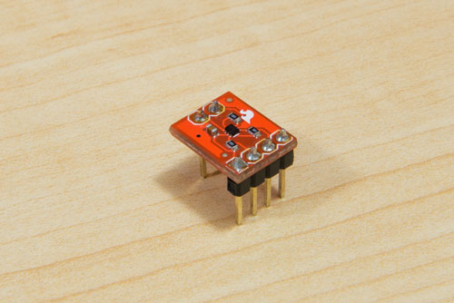
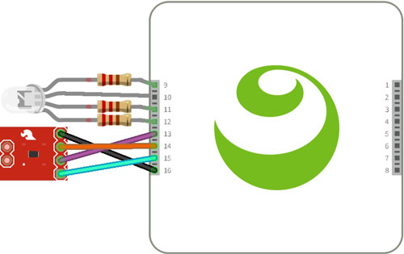

#I²C Temperature and PWM Tri-Color LED

See a video demonstration of this project [here](https://youtu.be/r5s2beC0tNw).

<!--
<iframe width='640' height='360' src="https://www.youtube.com/embed/r5s2beC0tNw?rel=0&amp;controls=1&amp;showinfo=0&autoplay=0" frameborder="0" allowfullscreen></iframe>
-->

##Components

- [TMP102 I²C Temperature Sensor](https://www.sparkfun.com/products/11931)
- [Common Anode RGB LED](https://www.sparkfun.com/products/10821)
- [330 Ohm Resistors (3)](https://www.sparkfun.com/products/8377)
- [Pin Headers](https://www.sparkfun.com/products/116)
- [M2F Jumper Wires](https://www.sparkfun.com/products/12794)

##Wiring

The RGB LED has four wires; three to control the intensity of each color using PWM and one to provide power (anode). The longest wire is the anode. To use the RGB LED you will first need to solder resistors to the PWM wires. If you want to learn why, SparkFun has an [excellent tutorial on LEDs](https://learn.sparkfun.com/tutorials/light-emitting-diodes-leds). 


You'll also need to solder pin headers to your temperature sensor. When finished, it should look like this:



The application code specifies the pin mapping. It is important that the physical wiring match the code.

The LED's mapping is as follows:

- Red PWM: 9
- Anode: 10
- Blue PWM: 12

The temperature sensor's mapping is as follows:

- SDA: 13
- SCL: 14
- Power (labeled VCC or V+): 15
- GND: 16



##Sample App

The easiest way to download any sample app is directly in [Kinoma Code](http://www.kinoma.com/develop/code) from the Samples tab.  The project name is element-temp-led. If you're not using Kinoma Code, it is available [here](https://github.com/Kinoma/KPR-examples/tree/master/element-temp-led) on GitHub.

The remainder of this tutorial will walk you through different sections of the code and explain how it all works together.

##Pin Configuration

The pin mapping is defined in the call to `Pins.configure` in the application file `main.js`. The numbering can be changed slightly, but be sure to check the [Kinoma Element pin map](http://kinoma.com/develop/documentation/pdf/element-pinmap.pdf) for details on which hardware protocols are supported by each pin and adjust the physical wiring to match the code.

```
Pins.configure({
	tmpSensor: {
		require: "TMP102",
		pins: {
			temperature: { sda: 13, clock: 14 },
			ground: { pin: 16, type: "Ground" },
			power: { pin: 15, type: "Power" },
		} 
	},
	led: {
		require: "led",
		pins: {
		    red: { pin: 9 },
		    power: { pin: 10, type: "Power" },
		    blue: { pin: 12 },
		}
	}
}
...
```

Once configured, we want to take readings from the temperature sensor and change the color of the light accordingly.  To do so we first define what 'cold' and 'hot' mean to provide a normal range of temperatures we expect to see.

```
let cold = 72;
let hot = 84;
let range = hot - cold;
```

Then we read the temperature sensor every 150ms and scale the temperature to a value between 0 and 1. Higher values cause the light to glow more red; lower values cause it to be more blue.

```
Pins.repeat("/tmpSensor/read", 150, temp => {
	var scaledTemp;
	if (temp <= cold) {
		scaledTemp = 0;
	} else if (temp >= hot) {
		scaledTemp = 1;
	} else {
		scaledTemp = (temp - cold)/range;
	}
	Pins.invoke("/led/write", {red: scaledTemp, blue: 1-scaledTemp});
});	
```

##BLLs

The temperature sensor and LED have separate [BLLs](http://kinoma.com/develop/documentation/element-bll/). They are short and could easily be combined into one, but it is useful to keep sensor logic in separate modules to make them easier to reuse in other projects.

The application file can interact with all BLLs in a project using the Pins module, as you saw in the previous section. BLLs cannot, however, access other BLLs directly.

###TMP102

This BLL can be configured to return the temperature value in degrees Fahrenheit or Celsius. By default it is set to return in Fahrenheit.

```
let FAHRENHEIT = true;
```

The `read` function converts data from the sensor into a readable format. According to the [sensor's datasheet](https://www.sparkfun.com/datasheets/Sensors/Temperature/tmp102.pdf), the temperature register is a 12-bit register so two bytes must be read to obtain data. We start by storing these bytes into a the `data` variable.

```
exports.read = function () {
    var data = this.temperature.readWordDataSMB(0);
    ...
```

The first 12 bits are used to indicate temperature; byte 1 is the most significant byte, and byte 2 the least significant byte. We therefore take the following steps:

- Take byte 1 and left shift it over 4 places
- Take the first 4 bits of byte 2
- Bitwise OR the two values together to get a 12 bit number


```
	...
	var value = ((data & 0xFF) << 4) | ((data >> 8) >> 4);
	...
```

This value matches the format described in Table 5 of the data sheet. Negative numbers are represented in [binary twos complement format](https://www.cs.cornell.edu/~tomf/notes/cps104/twoscomp.html), so if the first bit of `value` is 1, the temperature is below 0°C and additional formatting needs to be done. 

```
	...
	if (value & 0x800) {
		value -= 1;
		value = ~value & 0xFFF;
		value = -value;
	}
	...
```	
	
The last step is to convert the value to degrees Fahrenheit or Celsius and return it.
	
```
	...
	FAHRENHEIT? (value = value*(0.1125)+32) : (value *= 0.0625);
	return value;
}
```

###RGB LED

The BLL for the LED contains a custom `write` function that takes in a dictionary of values of the form `{red: x, blue: y}`, where x and y are numbers in the range of 0 and 1, inclusive. These numbers represent the [duty cycles](https://learn.sparkfun.com/tutorials/pulse-width-modulation/duty-cycle) of the red and blue pins. 

Because we are using a common anode LED, a higher duty cycle corresponds to dimmer lighting. However, in our application a higher red value is meant to make the light more red, and a higher blue value is meant to make it more blue. We therefore use the inverse of the values passed in.

```
exports.write = function(colorVals) {
	this.red.write(1 - colorVals.red);
	this.blue.write(1 - colorVals.blue);
}
```