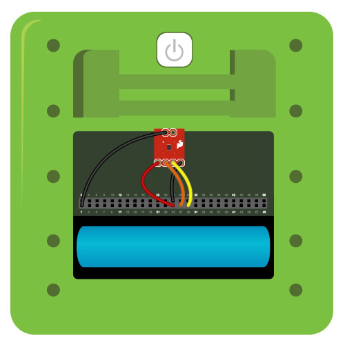

#I²C Temperature

Obtains the current temperature from an [I²C](../i2c) temperature sensor and displays it on the Kinoma Create's screen.

See a video demonstration of this project [here](https://youtu.be/PR8Eof011IA).

<!--
<iframe width="640" height="360" src="https://www.youtube.com/embed/PR8Eof011IA?rel=0&amp;controls=1&amp;showinfo=0&autoplay=0" frameborder="0" allowfullscreen></iframe>
-->

##Components

* [Digital Temperature Sensor Breakout](https://www.sparkfun.com/search`/results?term=tmp102)

##Notes

This temperature sensor is quite sensitive. Just set your finger on top of the board to make it jump dramatically.

##Setup

**Figure 1.** Wire up the I²C pins of the device as shown here. The address select pin should be grounded (as shown) to work with our sample code.



##Code Highlights

There are two files used in this application.

1. `main.js`, the application file
2. `TMP102.js`, the BLL for the temperature sensor

###Application

The UI is minimal. All we have is a white container with a label in the middle to display the current temperature. You can read more about defining user interfaces in our [Containment Hierarchy tutorial](http://kinoma.com/develop/documentation/kinomajs-tutorials/containment-hierarchy/).

```
let MainScreen = Container.template($ => ({
	left: 0, right: 0, top: 0, bottom: 0, skin: new Skin({ fill:'white' }),
	contents:[
		Label($, {
			left: 0, right: 0, string: '- - -',
			style: new Style({ font:'bold 46px Fira Sans', color: 'black' }),
...
```

As with all KinomaJS projects, we use the [Pins module](http://kinoma.com/develop/documentation/kinomajs-tutorials/create-pins-module/) to interact with the sensor. We make a call to `Pins.configure` in the label's behavior that specifies that we want to use the BLL `TMP102.js`  and the pins it uses.

```
Pins.configure({
	tmpSensor: {
		require: "TMP102",
		pins: {
			temperature: { sda:27, clock:29 }
		}
	}
}, ...
```

If the configuration is successful, we begin to read the temperature sensor every 300ms. The temperature returned by the BLL's `read` function is passed into the `onTemperatureChanged` function of the label's behavior.

```
Pins.repeat("/tmpSensor/read", 300, temperature => this.onTemperatureChanged(label, temperature));
```

`onTemperatureChanged` simply changes the string of the on-screen label.

```
label.string = temperature.toFixed(2) + ' ˚F';
```

####Temperature sensor BLL

This BLL can be configured to return the temperature value in degrees Fahrenheit or Celsius. By default it is set to return in Fahrenheit.

```
let FAHRENHEIT = true;
```

The `read` function converts data from the sensor into a readable format. According to the [sensor's datasheet](https://www.sparkfun.com/datasheets/Sensors/Temperature/tmp102.pdf), the temperature register is a 12-bit register so two bytes must be read to obtain data. We start by storing these bytes into a the `data` variable.

```
exports.read = function () {
    let data = this.temperature.readWordDataSMB(0);
    ...
```

The first 12 bits are used to indicate temperature; byte 1 is the most significant byte, and byte 2 the least significant byte. We therefore take the following steps:

- Take byte 1 and left shift it over 4 places
- Take the first 4 bits of byte 2
- Bitwise OR the two values together to get a 12 bit number

```
	...
	let value = ((data & 0xFF) << 4) | ((data >> 8) >> 4);
	...
```

This value matches the format described in Table 5 of the data sheet. Negative numbers are represented in [binary twos complement format](https://www.cs.cornell.edu/~tomf/notes/cps104/twoscomp.html), so if the first bit of `value` is 1, the temperature is below 0°C and additional formatting needs to be done. 

```
	...
	if (value & 0x800) {
		value -= 1;
		value = ~value & 0xFFF;
		value = -value;
	}
	...
```	
	
The last step is to convert the value to degrees Fahrenheit or Celsius and return it.
	
```
	...
	FAHRENHEIT? (value = value*(0.1125)+32) : (value *= 0.0625);
	return value;
}
```

##Download

You can download the i2c-temperature project [here](https://github.com/Kinoma/KPR-examples/tree/master/i2c-temperature) or in the Samples tab of Kinoma Code.