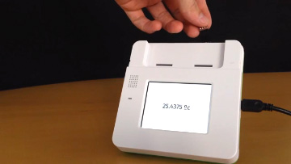
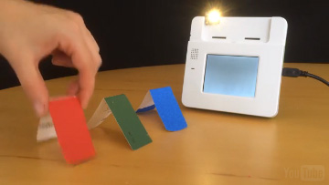

#I²C

The I²C bus is a means of communicating with more complicated sensors and (especially) breakout boards--parts that have some intelligence of their own and can speak a more complicated language. Our I²C stack supports both raw I²C communication and SMB. Most modern sensor breakouts use SMB, which is easier to deal with than the raw version.

###Brief Overview of the I²C Communication Protocol 

The physical I²C bus consists of just two wires.

- `SCL`: the clock line
- `SDA`: the data line

All devices on the bus are connected to these wires. These devices are either `masters` or `slaves`. Masters initiate data transfers and drive the SCL clock line to synchronize them. Slaves respond to the master. Each slave has an address, which allows the master to send commands to a specific device. Kinoma devices are the master when working with I²C sensors.

The I²C communication protocol is complicated. You don't need to know all the details about it to work with I²C sensors, but you will need to have a high level understanding and learn to read sensor datasheets. A walkthrough tutorial to create a BLL for [this I²C color sensor](https://www.adafruit.com/products/1334) can be found [here](../../kinomajs-tutorials/building-a-bll/#building-your-own-blls-i2c-color-sensor). For more in depth explanations of the I²C protocol, [SparkFun](https://learn.sparkfun.com/tutorials/i2c) and [Robot Electronics](http://www.robot-electronics.co.uk/i2c-tutorial) have excellent tutorials. 

###Examples of I²C Sensors

- [TCS34725 RGB color sensor](https://www.adafruit.com/products/1334) 
- [TMP102 temperature sensor](https://www.sparkfun.com/products/11931)
- [PN532 NFC/RFID controller breakout board](https://www.adafruit.com/products/364)

###Configuration

As you can see in their respective tutorials, configuring and programming with [analog](../analog) and [digital](../digital) pins is very straightforward. I²C sensors can also be configured with the Front Pins app and read from/written to in the Pin Explorer app, but it requires a few additional steps.

<!-- webinar https://youtu.be/R5v9oEsOtgo?t=12m43s -->
[This video](https://youtu.be/GTHhzzb821c) shows an RGB color sensor being configured through the Front Pins app and the use of the Pin Explorer app to read register 0x12 (which, according to the sensor's [datasheet](https://www.adafruit.com/datasheets/TCS34725.pdf) stores the device ID).

<!--
<iframe width="100%" height="500" src="https://www.youtube.com/embed/GTHhzzb821c?rel=0&amp;vq=hd1080" frameborder="0" allowfullscreen></iframe>
-->

###Programming I²C Pins

####BLL

`I2C.js`, the built-in I²C BLL, contains many functions that correspond to all of the API calls supported by I²C pins. For more details on the arguments to each of these functions, see the [pins documentation](http://kinoma.com/develop/documentation/pins/). The source code is shown below.

```
//@module
exports.pins = {
	i2c: {type: "I2C"}
}
	
exports.configure = function() {
	this.i2c.init();
}
	
exports.close = function() {
	this.i2c.close();
}
	
exports.readByte = function() {
	return this.i2c.readByte();
}
	
exports.readBlock = function(param) {
	return this.i2c.readBlock(param.count, param.format);
}
	
exports.readByteDataSMB = function(register) {
	return this.i2c.readByteDataSMB(register);
}
	
exports.readWordDataSMB = function(register) {
	return this.i2c.readWordDataSMB(register);
}
	
exports.readBlockDataSMB = function(param) {
	return this.i2c.readWordDataSMB(param.register, param.count, param.type);
}
	
exports.writeByte = function(value) {
	return this.i2c.writeByte(value);
}
	
exports.writeBlock = function(param) {
	this.i2c.writeBlock(param);
}
	
exports.writeByteDataSMB = function(param) {
	return this.i2c.writeByteDataSMB(param.register, param.value);
}
	
exports.writeWordDataSMB = function(param){
	return this.i2c.writeWordDataSMB(param.register, param.value);
}
	
exports.writeBlockDataSMB = function(param) {
	this.i2c.writeBlockDataSMB(param.register, param.value);
}
	
exports.writeQuickSMB = function(value) {
	this.i2c.writeQuickSMB(value);
}
	
exports.processCallSMB = function(param) {
	return this.i2c.processCallSMB(param.register, param.value);
}
```

It usually makes more sense to create custom BLLs for I²C sensors because it allows you to reuse the module in other projects and simplify the logic in the application code. You can see several examples in our [sample app repository](https://github.com/Kinoma/KPR-examples), including the [i2c-nfc](https://github.com/Kinoma/KPR-examples/tree/master/i2c-nfc) and [i2c-color-sensor](https://github.com/Kinoma/KPR-examples/tree/master/i2c-color-sensor) samples.

####Interacting with the BLL from your Application

The application file (`main.js` in all of our samples) is where you will configure the sensor and call the functions in its BLL. This is most easily done using the [Pins module](../../create-pins-module/).

```
Pins.configure({
	i2cSensor: {
		require: "BLL-NAME-HERE", //"I2C" if using the built-in BLL
    	pins: {
     		i2c: { sda: 53, clock: 54 }
    	}
  	}
}, success => {
	if (success) {
		Pins.invoke("/i2cSensor/readByteDataSMB", 0x24, data => {
			// do something with data from register 0x24
		});
	}
});
```


###Basic Sensor Tutorials

####[I²C Temperature](../i2c-temperature/i2c-temperature.md)



Obtains the current temperature from an I²C temperature sensor and displays it on the Kinoma Create screen.

####[Color Sensor](../i2c-color-sensor/i2c-color-sensor.md)



Fills the Kinoma Create's screen with the color sensed by an RGB color sensor. Uses I²C to talk to the color sensor.

###Project Tutorials
####[Sparkle Motion Project](../../projects/sparkle-motion/sparkle-motion-160616a-CR.md)


An LED world map driven by global tweet data. You can make this project to learn how to control an array of LEDs, use OAuth-based services, and more
