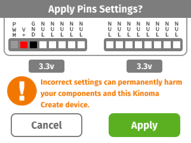
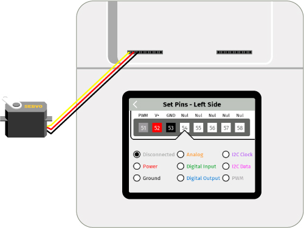

<!-- Note to self: revise video on this -->

#PWM Continuous Servo

Rotates a continuous servo using a [PWM](../pwm) pin.

See a video demonstration of this project [here](https://youtu.be/m9Sk-kffWyk).

<!--
<iframe width="640" height="360" src="https://www.youtube.com/embed/m9Sk-kffWyk?rel=0&amp;controls=1&amp;showinfo=0&autoplay=0" frameborder="0" allowfullscreen></iframe>
-->

##Components

* [Generic Servo Motor](https://www.sparkfun.com/products/9347)

##Notes

Servos have many uses, such as rotating objects, driving wheels, and robotics. Small servos can be powered using Kinoma Create's on-board power pins. More powerful servos should be powered with external batteries or power supplies.

##Setup

You can mux the pins using the Front Pins app prior to running the project, but it's not necessary to do so as the application code does it for you. Figure 2 shows how to mux the pins using the Front Pins app.

**Figure 1.** If you choose not to mux the pins using the Front Pins app, a confirmation dialog box will pop up on the screen of your Kinoma Create to confirm the muxing when you run the project. 



**Figure 2.** The servo needs power and ground in addition to the PWM pin that controlls it.



The PWMs on the rear header are tuned to control LEDs. The PWMs on the front are tuned to control servos. You can plug a servo into the back pins or an LED into the front pins, but you may get better results using them as they are intended to be used.


##Code Highlights

There are two files used in this application.

1. `main.js`, the application file
2. `servo.js`, the BLL for the servo

###Servo BLL

The front pins allow you to pass in a pulse width and period OR a duty cycle to the `PWM.write` function. If you only pass in a duty cycle, the period defaults to 50Hz/20ms. Some motors may work better with a different period and therefore require two arguments. The motor we used works well with the default period, so we simply use a 50% duty cycle in the `rotate` function.

```
exports.rotate = function() {
	this.servo.write( 0.5 );
}

exports.stop = function() {
	this.servo.write( 0 );
}
```

###Application

####Defining the UI

You can customize the color and text style of the background and button by changing the `Skins` and `Style` at the beginning of the code. You can read more about these in the [KinomaJS JavaScript Reference](../..javascript/) or the [Containment Hierarchy tutorial](../../kinomajs-tutorials/containment-hierarchy/).

You'll note that `MainSkin` only has a single fill color, but `ButtonSkin` has an array containing two colors. `MainSkin` is used by the `MainContainer` template, which fills the background and contains the button. The first item in the array of `ButtonSkin` is the color of the button when the state of its container is 0; the second item is the color of the button when the state of its container is 1.

```
let MainSkin = new Skin({ fill: '#F0F0F0' });
let ButtonSkin = new Skin({ fill: ['#707070','#2E2E2E'] });
let ButtonStyle = new Style({ font: 'bold 50px', color: 'white' });
```

The state of the button is changed in the `onTouchBegan` and `onTouchEnded` functions in its behavior. `onTouchBegan` and `onTouchEnded` are built-in functions that can be used in any KinomaJS application for a device with a touch screen. You can read more about them in our [Application Logic in Behaviors tutorial](../../kinomajs-tutorials/behaviors/). 

```
Behavior: class extends Behavior {
	onTouchBegan(container) {
		container.state = 1;
		Pins.invoke("/motor/rotate");             
	}
	onTouchEnded(container) {
		container.state = 0;
		Pins.invoke("/motor/stop");             
	}
},
```

As you can see, the `onTouchBegan` and `onTouchEnded` functions also call the `rotate` and `stop` functions in the servo BLL.

####Application set up

The `onLaunch` function of the application's behavior is where we put together the UI and configure the pins. As with all KinomaJS projects, we use the [Pins module](http://kinoma.com/develop/documentation/create-pins-module/) to interact with the servo. The call to `Pins.configure` specifies that we want to use `servo.js` and the pins it uses.

```
Pins.configure({
	motor: {
		require: "servo",
		pins: {
			servo: { pin: 51 },
			power: { pin: 52, type: "Power", voltage: 3.3 },
			ground: { pin: 53, type: "Ground"}
		}
	}
}, ...
```

If the pins are successfully configured, we add an instance of our `MainScreen` template to the application.		
		
```
...
success => {
	if (success)
		application.add(new MainScreen());
	else
		trace("Failed to configure pins.\n");
});

```

##Download

You can download the pwm-continuous-servo project [here](https://github.com/Kinoma/KPR-examples/tree/master/pwm-continuous-servo) or in the Samples tab of Kinoma Code.
