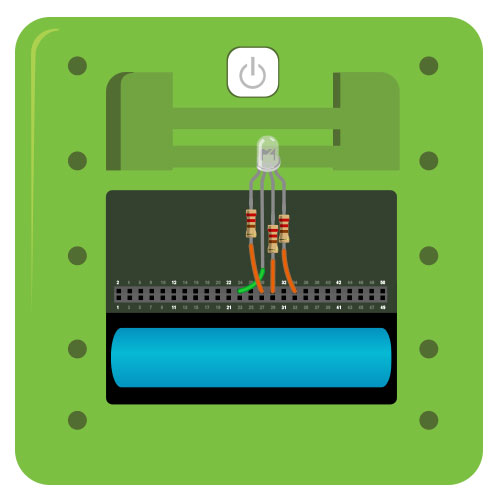
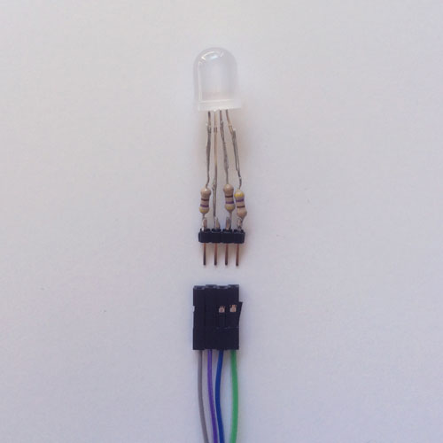

#PWM Tri-Color LED

Uses red/green/blue sliders to control the color of an RGB LED. The LED is controlled by [PWM](../pwm) pins.

See a video demonstration of this project [here](https://youtu.be/Jt6ERKKyjos).

<!--
<iframe width="640" height="360" src="https://www.youtube.com/embed/Jt6ERKKyjos?rel=0&amp;controls=1&amp;showinfo=0&autoplay=0" frameborder="0" allowfullscreen></iframe>
-->

##Components

* [Common Anode RGB LED](https://www.sparkfun.com/products/8377)
* [330 Ohm Resistor](https://www.sparkfun.com/products/8377) (x3)

##Setup

**Figure 1.** The anode of the LED goes to power while the other three legs go through resistors and then to the Kinoma Create PWM pins.



**Figure 2.** We soldered current-limiting resistors to the legs of the LED, as well as headers to ensure that it would fit snugly with our female/male jumper wires.



##Code Highlights

There are three files used in this application.

1. `main.js`, the application file
2. `slider.js`, a module that contains all the logic related to the on-screen sliders that control the color of the LED
2. `led.js`, the BLL for the RGB LED

###RGB LED BLL

The BLL for the LED contains a custom `write` function that takes in a dictionary of the form `{ red: x }`, `{ green: x }`, or `{ blue: x }`, where x is a number in the range of 0 and 1, inclusive. This number represents the [duty cycle](https://learn.sparkfun.com/tutorials/pulse-width-modulation/duty-cycle) of the red, blue, or green pin. 

Because we are using a common anode LED, a higher duty cycle corresponds to dimmer lighting. However, in our application a higher value is meant to make the the corresponding color brighter. We therefore use the inverse of the values passed in.

```
exports.write = function( parameters ) {
	switch( parameters.color ){
		case( "red" ):
			this.red.write( 1 - parameters.value );
			return;
		case( "green" ):
			this.green.write( 1 - parameters.value );
			return;
		case( "blue" ):
			this.blue.write( 1 - parameters.value );
			return;
	}
}
```

###Setting up the sliders

You can adjust the look of each individual slider by changing properties in the corresponding dictionary in `main.js`. The `label`, `min`, and `max` properties should be left as they are, but the rest can be arbitrarily changed.

```
let redSliderData = {
	label:"red",
	min:0, 
	max:1, 
	value:0, 
	circleColor: "red", 
	strokeColor: lineColor, 
	strokeWidth: 10,  
	radius: circleRadius 
};
```

`MainContainer` is a `column` template that contains a slider for each color. When the circle is dragged, the value of the slider is changed and we call the `write` function in the LED BLL to update the color of the LED.

```
let MainContainer = Column.template($ => ({ 
	left: 10, right: 10, top: 10, bottom: 10, 
	skin: backgroundSkin, 
	contents: [
		CircleSlider( redSliderData ),
		CircleSlider( greenSliderData ),
		CircleSlider( blueSliderData )
	],
	behavior: Behavior({
		onChanged: function(canvas, value, color) {
			Pins.invoke("/led/write", { color, value } );
		},
	})
}));
```

> Note: `{ color, value }` is shorthand for `{ color: color, value: value }`

`onChanged` is invoked by the `setValue` function in the behavior of the circle sliders, which is defined in `slider.js`.

```
setValue( canvas, value ) {
    this.data.value = value;
    canvas.container.distribute( "onChanged", this.getValue(), this.data.label );
}
```

The value of the sliders is determined by the circle's position on the screen. We keep track of the circle's movement using built-in touch functions (`onTouchBegan` and `onTouchEnded`), which can be used in any KinomaJS application for a device with a touch screen. You can read more about these functions in our [Application Logic in Behaviors tutorial](https://github.com/Kinoma/KPR-examples/tree/master/audio-recorder-playerkinomajs-tutorials/behaviors/).

###Pin configuration and application setup

The `onLaunch` function of the application's behavior is where we build the UI and configure the pins. As with all KinomaJS projects, we use the [Pins module](https://github.com/Kinoma/KPR-examples/tree/master/audio-recorder-playercreate-pins-module/) to interact with the LED. The call to `Pins.configure`specifies that we want to use `led.js` and the pins it uses. If the configuration is successful, we add an instance of our `MainContainer` template to the application.

```
application.behavior = Behavior({
	onLaunch: function(application) {
		Pins.configure({
			led: {
		        require: "led",
		        pins: {
		            red: { pin: 28 },
		            green: { pin: 30 },
		            blue: { pin: 34 }, 
		            anode: { pin: 24 }
		        }
		   },
		}, function(success) {
			if (success)
				application.add( new MainContainer() );
			else 
				trace("Failed to configure pins.\n");	
		});
	}
});
```

##Download


You can download the pwm-tri-color-led project [here](https://github.com/Kinoma/KPR-examples/tree/master/pwm-tri-color-led) or in the Samples tab of Kinoma Code.