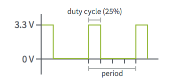
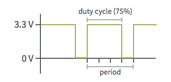
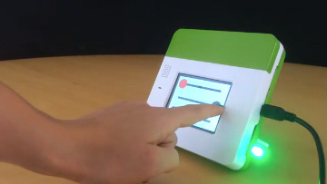
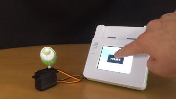

#PWM

PWM is a special type of digital signal commonly used in motors and RGB LEDs. The front pins of Kinoma Create support up to six PWM outputs and are tuned to control the hobby servos commonly used in robotics and remote control model vehicles. The three PWM outputs on the back pins are tuned to control LEDs.

###Brief Overview of PWM

PWM (Pulse Width Modulation) is the rough equivalent of an analog output but achieved with a digital signal. The pin will output a square wave with varied widths of high vs. low values. By taking the average of these pulses of high and low, an artificial analog voltage results between 0-3.3V. (0-5V if working on Kinoma Create's front pins with the header configured to 5V.) 

The **duty cycle** is the percentage of time that the signal is high over a period of time. The **period** is the inverse of the frequency of the waveform. If the digital signal is on half of the time, the duty cycle is 50% and a graph of the signal would look like this:


If it spends less time on than it does off, the duty cycle will be less than 50%; if it spends more time on than it does off the duty cycle will be greater than 50%. Here are graphs of signals with 25% and 75% duty cycles, respectively.






###Examples of PWM Sensors

- [RGB LED](https://www.sparkfun.com/products/10821)
- [Generic Servo Motor](https://www.sparkfun.com/products/9347)
- [Micro Servo Motor](http://www.vetco.net/catalog/product_info.php?products_id=12845&gclid=CIKB-Jqq2ssCFcRgfgod2TkL_w)

###Configuration

When working with LEDs, all you will need to pass in is the **duty cycle**. This should be represented by a value in the range of 0-1, inclusive.

When working with servos, you can pass in a **period** and a **pulse width**. 

- The period should be a value between 1-30, inclusive. This represents the length of the period in milliseconds. 
- The pulse width should be a value between 0 and the specified period. This represents the length of time (in milliseconds) that the signal should be high in a single period. In other words, pulse width=duty cycle*period.

[This video](https://youtu.be/ySMCu2ryqPQ) shows an RGB LED and a micro servo motor being configured through the Front Pins app and the use of the Pin Explorer app to control them. You may note that the LED flickers quite a bit; plugging LEDs into the back PWM pins reduces the flickering considerably.

<!--

<iframe width="100%" height="500" src="https://www.youtube.com/embed/ySMCu2ryqPQ?rel=0&amp;vq=hd1080" frameborder="0" allowfullscreen></iframe>
-->

###Programming PWM Sensors

####BLL

`PWM.js`, the built-in PWM BLL, contains just three functions:

1. `configure`: initializes the pin connection
2. `write`: sets the PWM frequency to the floating point value provided (between 0 and 1, inclusive). If the parameter is an array, the first element is the duty cycle and the second element is the period. If there is only one element in the array, the period will be twice the duty cycle.
3. `close`: closes the pin connection

Here is the full source code of PWM. It's short, but often enough for simple projects.

```
//@module
exports.pins = {
	pwm: {type: "PWM"}
}
	
exports.configure = function() {
	this.pwm.init();
}
	
exports.close = function() {
	this.pwm.close();
}
	
exports.write = function(value) {
	if ( Array.isArray(value) ) return this.pwm.write( value[0], value[1] ); 
	else return this.pwm.write( value );
}
```
	
Some projects may call for more than the simple write function provided. For these you will need to create a custom BLL. A good example of this is [`led.js`](https://github.com/Kinoma/KPR-examples/blob/master/pwm-tri-color-led/device/led.js) from our [pwm-tri-color-led sample app](https://github.com/Kinoma/KPR-examples/tree/master/pwm-tri-color-led); this BLL has a custom write function that takes in a JSON object with color and value properties and writes to the proper pin, rather than using the built-in PWM BLL for each wire separately.

```
exports.write = function( parameters ) {
	switch( parameters.color ){
		case( "red" ):
			this.red.write( 1 - parameters.value );
			return;
		case( "green" ):
			this.green.write( 1 - parameters.value );
			return;
		case( "blue" ):
			this.blue.write( 1 - parameters.value );
			return;
	}
}
```

####Interacting with the BLL from your Application

The application file (`main.js` in all of our samples) is where you will configure the sensor and call the `write` function or other custom functions in its BLL. This is most easily done using the [Pins module](http://kinoma.com/develop/documentation/create-pins-module/).

```
var Pins = require("pins");
Pins.configure({
	pwmSensor: {
		require: "BLL-NAME-HERE", //"PWM" if using the built-in BLL
    	pins: {
     		pwm: { pin: 53 }
    	}
  	}
}, success => {
	if (success) {
		Pins.invoke("/pwmSensor/write", [0.5, 5] ); // this would set a servo's pulse width to 0.5 and period to 5
		Pins.invoke("/pwmSensor/write", 0.5); // you should only pass in one number for an LED
	}
});
```

###Basic Sensor Tutorials
####[Tricolor LED](../pwm-tri-color-led/pwm-tri-color-led.md)



Uses red/green/blue sliders to control the color of an RGB LED. The LED is controlled by PWM pins.

####[PWM Continuous Servo](../pwm-continuous-servo/pwm-continuous-servo.md)



Rotates a continuous servo using a PWM pin.

