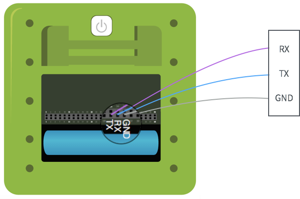
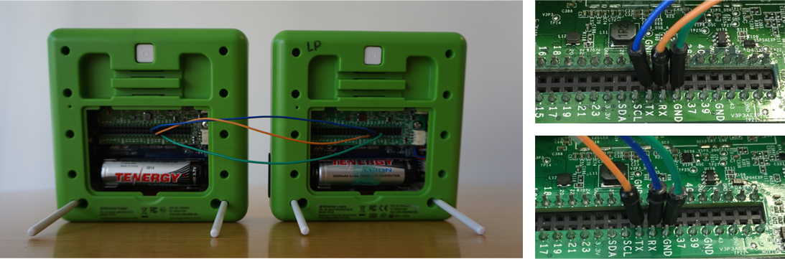
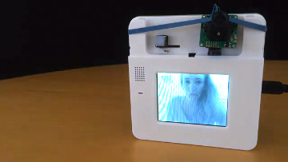

#Serial

The serial bus is a means of communicating with other devices by streaming data one bit at a time. The RX and TX pins on the back of Kinoma Create are used for serial/UART communication. 

###Brief Overview of the Serial Communication Protocol

The physical serial bus consists of just two wires.

- **TX**: the transmitter (to send data)
- **RX**: the receiver (to receive data)

The TX pin on Kinoma Create should be connected to the RX pin of the other device. Similarly, the RX pin on Kinoma Create should be connected to the TX pin of the other device. They also need to share a ground wire.



The **baud rate** is a fixed rate that specifies how fast data is sent, usually expressed in bits per second. Devices communicating over a serial line need to operate at the same baud rate. This should be specified in your code to match the other device.

###Examples of Serial Sensors

- [Serial JPEG Camera](https://www.adafruit.com/product/397)
- [7-Segment Serial Display](https://www.sparkfun.com/products/11629)
- [Fingerprint Scanner](https://www.sparkfun.com/products/11792)

###Configuration

Two Kinoma Create devices can be connected together to use serial communication. The wiring looks like this:




[This video](https://youtu.be/qYF6S7R3Ujs) demonstrates how to use the Pin Explorer app to send and receive text after wiring the two devices together. 

<!--
The video below demonstrates how to use the Pin Explorer app to send and receive text after wiring the two devices together. 

<iframe width="100%" height="500" src="https://www.youtube.com/embed/qYF6S7R3Ujs?rel=0&amp;vq=hd1080" frameborder="0" allowfullscreen></iframe>
-->

###Programming Serial Sensors

####BLL

`Serial.js`, the built-in serial BLL, contains just 4 functions:

1. `configure`: initializes the pin connection
2. `read`: reads data from the serial input. See the [serial section of pins documentation](http://kinoma.com/develop/documentation/pins/) for what can be passed in here.
3. `write`: writes all arguments to the output. Values can be of type ArrayBuffer, String, Array of character codes, or numbers (character codes from 0 to 255).
4.  `close`: closes the pin connection

Here is the full source code of `Serial.js`.

```
//@module
exports.pins = {
	serial: {type: "Serial"}
}
	
exports.configure = function() {
	this.serial.init();
}
	
exports.close = function() {
	this.serial.close();
}
	
exports.read = function(param) {
	if (typeof param == "string")
		return this.serial.read(param);
	
	if (!("maximumBytes" in param))
		throw new Error("maximumBytes not specified");
	
	if ("msToWait" in param)
		return this.serial.read(param.type, param.maximumBytes, param.msToWait);
	
	return this.serial.read(param.type, param.maximumBytes)
}
	
exports.write = function(param) {
	this.serial.write(param);
}
```
	
The built-in BLL may be enough for simple projects, but you will note that serial sensor BLLs are often much more complex than the above example. You can see several examples in our [sample app repository](https://github.com/Kinoma/KPR-examples), including the [serial-camera](https://github.com/Kinoma/KPR-examples/tree/master/serial-camera/device) and [serial-fingerprint-lock](https://github.com/Kinoma/KPR-examples/tree/master/serial-fingerprint-lock) apps.

####Interacting with the BLL from your Application

The application file (`main.js` in all of our samples) is where you will configure the sensor and call the `read`, `write`, or other custom functions in its BLL. This is most easily done using the [Pins module](http://kinoma.com/develop/documentation/create-pins-module/).

```
Pins.configure({
	serialSensor: {
   		require: "BLL-NAME-HERE", //"Serial" if using the built-in BLL
   		pins: {
      		serial: { rx: 33, tx: 31, baud: 9600 }
    	}
  	}, success => {
  		if (success) {
  			Pins.invoke("/serialSensor/read", "Array", data => {
  				//do something with array of data returned
  			});
  			Pins.invoke("/serialSensor/read", { type: "String", maximumBytes: 2 }, data => {
  				//do something with string of data returned
  			});
  			Pins.invoke("/serialSensor/write", "Hello!");
  		}
  	});
```

###Basic Sensor Tutorials

####[Camera](../camera/camera.md)



Captures and displays photographs on the screen when a button is pressed. Uses Serial I/O to talk to the camera.

###Project Tutorials
####[Camera Trap](../../projects/camera-trap/camera-trap-160616a-CR.md)


Break a laser beam, get caught by the Kinoma Create-controlled camera.