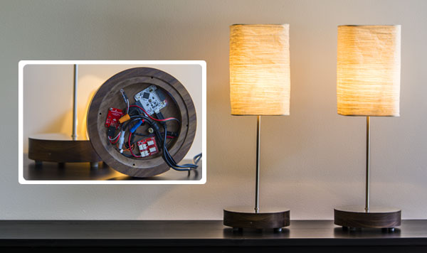
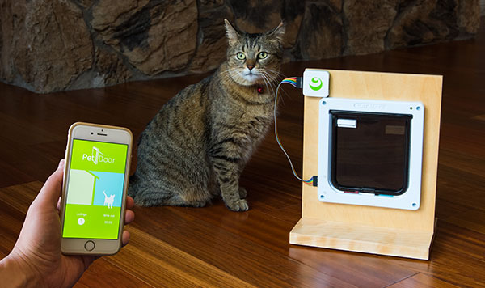
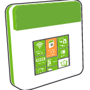
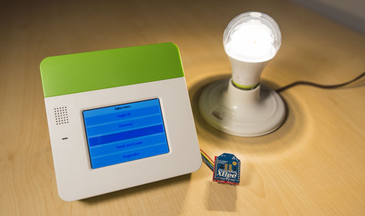
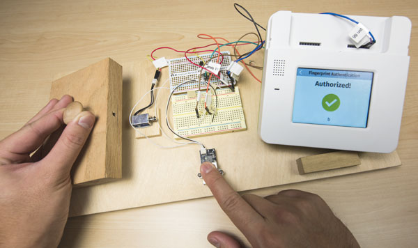
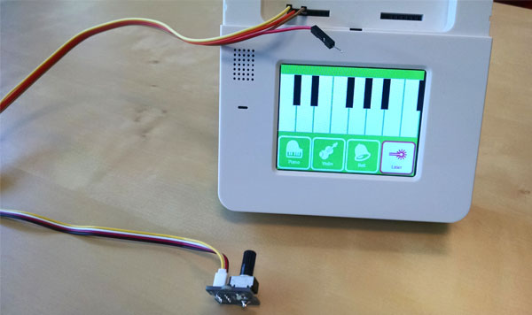
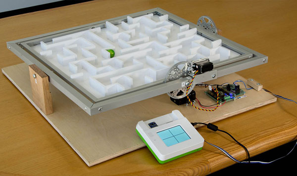
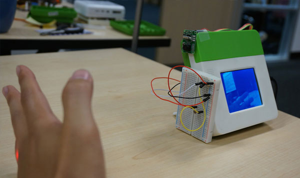
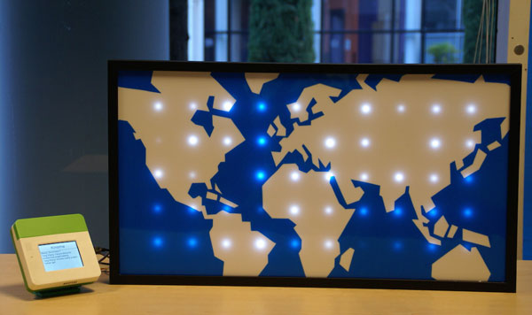
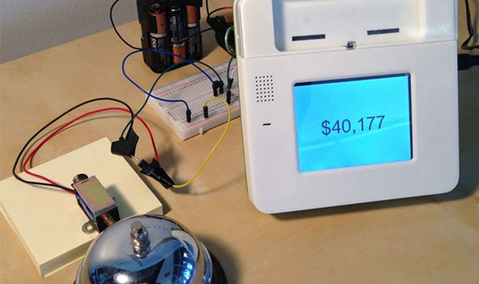

#Kinoma Projects

These robust project tutorials detail the code and step-by-step instructions for building the project components.

## <a href="./twin-lamps/twin-lamps.md">Twin Lamps</a>

**Difficulty:** Moderate 
**Time:** 5-6 hours

Create a network of touch-controlled lamps with Kinoma Element, capacitive touch sensors and relays.

Kinoma Element can power 3.3V sensors, but some projects call for the use of higher-current devices. The Tessel Relay module makes it easy to toggle externally-powered devices on and off. In this project, we control a network of two lamps using Kinoma Element, capacitive touch sensors, and relays.

			

***

## <a href="./cat-door/cat-door.md">Cat Door</a>

**Difficulty:** Easy 
**Time:** 3-4 hours

Connect Kinoma Element and sensors to a cat door to keep track of your pet’s activity.

This simple project can track a cat's in-and-out activity using an off-the-shelf cat door, Kinoma Element, a basic LED, and two sets of magnetic reed sensors. The optional mobile companion app, also built with KinomaJS, tells you where your cat currently is and keeps track of how much time your cat spends outside.

			

***

<!--
NO MARKDOWN FILE

## <a href="./home-automation/FILE.md">Home Automation</a>

**Difficulty:** Easy 
**ho** 2 hours

Turn Kinoma Create into a ZigBee Home Automation gateway, and control your lighting.

Many home appliances include wireless light bulbs that support ZigBee Home Automation, a wireless standard that enables smart objects to work together in the home. For this project, we use a GE Link light bulb which is a ZigBee Home Automation compatible device, and can be controlled from anywhere via a mobile app.

			

***
-->

<!-- INCOMPLETE MARKDOWN FILE-->
## <a href="./fingerprint-lock/fingerprint-lock-160630-CR.md">Fingerprint Lock</a>

**Difficulty:** Moderate 
**Time:** 2 hours

Use your fingerprint instead of a key to unlock a door.

In this project, we build a biometric fingerprint-controlled lock prototype. A fingerprint scanner on Kinoma Create is used to capture and store the fingerprints of authorized users. When the scanner recognizes a user, a solenoid plunger disengages and opens the lock.

			

***

<!-- INCOMPLETE MARKDOWN FILE-->
## <a href="./synthesizer/synthesizer-160616a-CR.md">Synthesizer</a>

**Difficulty:** Easy 
**Time:** 1 hour

Build a keyboard UI with five sound synthesis modes.

Here we build a keyboard UI with five synthesis modes all in JavaScript, to show the power of using Kinoma Create's audio output hardware pin. As discussed in the Tech Note Playing Audio with KinomaJS, using the audio output hardware pin is the most flexible--and the most complex--way to play sounds from Kinoma Create. This simple example will serve as a good starting point.

			

***

<!-- NO MARKDOWN FILE
## <a href="./tilting-tables/FILE.md">Tilting Tables</a>

**Difficulty:** Moderate 
**Time:** 16-20 hours

Using sensors and actuators to make a mechanical labyrinth maze.

A three axis accelerometer captures the tilt of the Kinoma Create. Kinoma Create processes the tilt data in software to control the the rotation of two servo motors connected to the maze. The result is intuitive movement of the maze relative to the controller. Mechanical gears convert the 180 degrees of servo rotation into 16 degrees needed for maze control.

			

***
-->

<!-- INCOMPLETE MARKDOWN FILE-->
## <a href="./camera-trap/camera-trap-160616a-CR.md">Camera Trap</a>

**Difficulty:** Moderate 
**Time:** 8-10 hours

Break a laser beam and get caught by the Kinoma Create-controlled camera.

Here we build a camera trap, which takes pictures of whatever blocks a laser beam. A laser pointer and a photoresistor are used to detect blocking. A serial camera is used to take a picture and send the data back to Kinoma Create through UART serial ports. Then the picture is sent to the laptop and stored in a folder.

			

***

<!-- INCOMPLETE MARKDOWN FILE-->
## <a href="./sparkle-motion/sparkle-motion-160616a-CR.md">Sparkle Motion</a>

**Difficulty:** Moderate 
**Time:** 8-10 hours

Create an LED world map driven by global Twitter traffic data.

This project illustrates how to control an array of LEDs, use OAuth-based services, and more. We build a light that changes its flicker behavior by monitoring global Twitter traffic. Fifty LEDs are embedded behind a large, translucent white acrylic board to form a map of the world, with a blue vinyl film glued onto the board. This map serves as a low-res display for illustrating global Twitter traffic.

			

***

<!-- INCOMPLETE MARKDOWN FILE-->
## <a href="./ringer/ringer-160616a-CR.md">Ringer</a>

**Difficulty:** Moderate 
**Time:** 8-10 hours

Ring a bell as an Indiegogo contribution monitor.

We built a monitor that rang a bell every time a new person supported Kinoma's Indiegogo campaign and purchased a Kinoma Create device. In this project, Kinoma Create runs an app that scrapes the Indiegogo campaign page periodically and displays the total amount contributed. When new contributions are made, it physically rings a bell by striking it with a solenoid.

			

***
