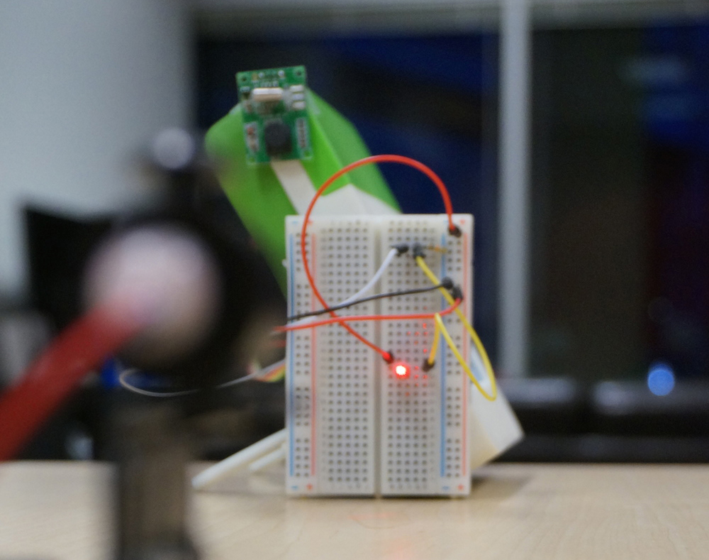
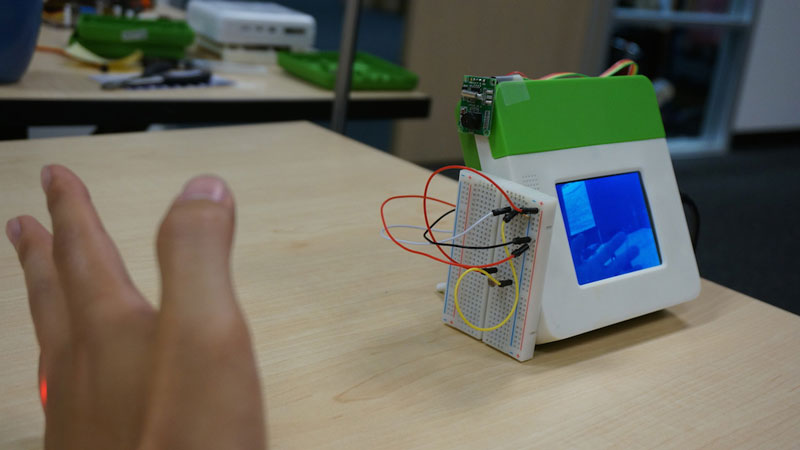
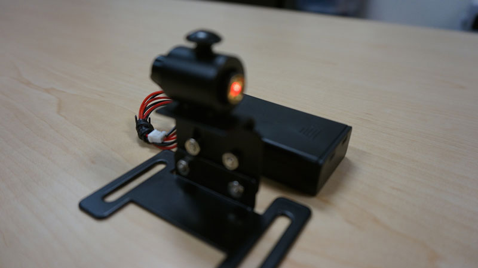
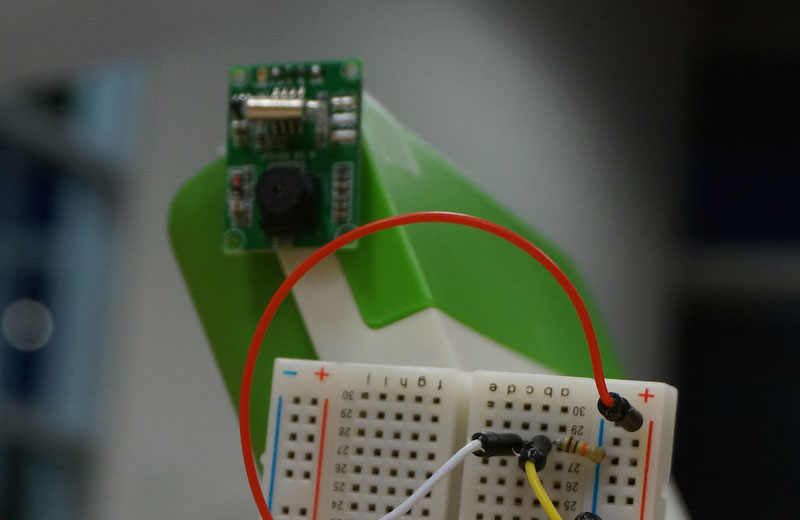
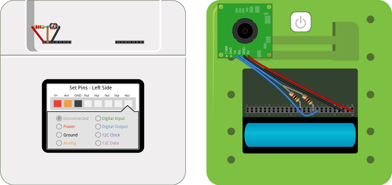

<!-- Version: 160616a-CR / Primary author: ? / Last reviewed: Old project, no longer being reviewed
-->

#Camera Trap

Break a laser beam and get caught by the Kinoma Create-controlled camera.



---

AT A GLANCE

Project: Camera Trap

Difficulty: Moderate

Time: 8-10 hours

---

#Overview

Here we build a camera trap, which takes pictures of whatever blocks a laser beam. A laser pointer and a photoresistor are used to detect blocking. A serial camera is used to take a picture and send the data back to Kinoma Create through UART serial ports. Then the picture is sent to the laptop and stored in a folder.

<b>Note:</b> The source code for this older project is no longer available for downloading; only snippets are shown here. If you are interested in getting the full source, you can post an inquiry on the Kinoma Create Forum or send an email to developer@kinoma.com.



##Parts list

1. Kinoma Create
2. Serial camera
3. Laser diode
4. Laser mounting stand
5. Photoresistor

##1 Laser polling

We use a handler to poll the voltage reading of pin 47. Whenever the voltage is higher than the threshold, the handler calls the `takePicture` method to take a picture. We implemented a loop by having the `time1` handler and the `delay1` handler call each other.



```
<handler path="/time1">
   <behavior>
      <method id="onInvoke" params="handler, message"><![CDATA[
         var vread = a2d.read([47]);
         if (vread[47] < threshold) {
            if (previous_state == "not_blocked") {
               trace("take a picture\n")
               application.distribute("takePicture");
            }
            previous_state = "blocked";
         }
         else {
             previous_state = "not_blocked";
         }
         handler.invoke( new Message( "/delay1?duration=5" ) );
      ]]></method>
   </behavior>
</handler>
```

##2 Camera capture and saving to JPEG

After a new picture is successfully uploaded from the camera to the Kinoma Create, a request is sent from laptop side and the picture is fetched back in the format of a chunk.



```
<handler path="/request_pic">
    <behavior>
       <method id="onInvoke" params="handler, message"><![CDATA[
            handler.wait(1000);
        ]]></method>

        <method id="onComplete" params="handler, message"><![CDATA[
            var file = mergeURI(Files.temporaryDirectory, "capera.jpg");
            handler.message.responseChunk = Files.readChunk(file);
        ]]></method>

    </behavior>
</handler>
```

##3 Photoresistor wiring and project setup

We first connect the photoresistor to a pull-up resistor. The junction where the resistor and photoresistor meet goes to pin 47. Then we connect the serial camera to the Kinoma Create and adjust the laser pointer to point at the photoresistor.



##4 Finish

After completing the steps above, we assemble all the parts together and upload the program to the Kinoma Create. Then we run the laptop-side program in the simulator.

#Congratulations!

You have successfully created a camera trap!
