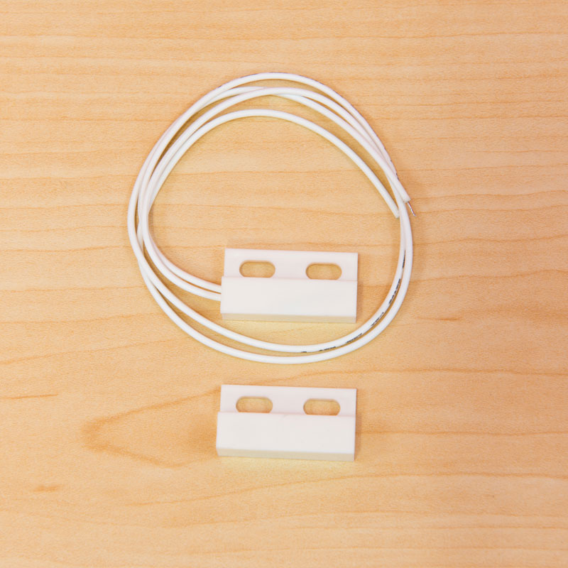
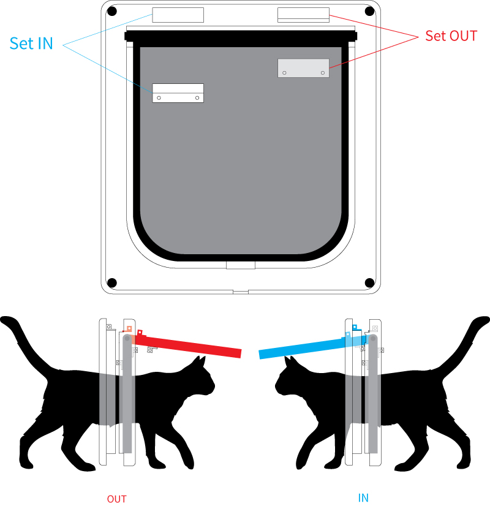
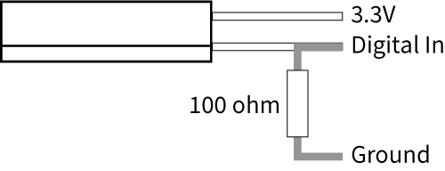
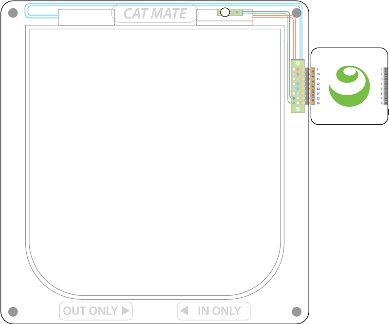
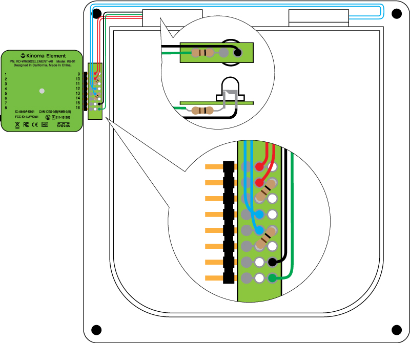
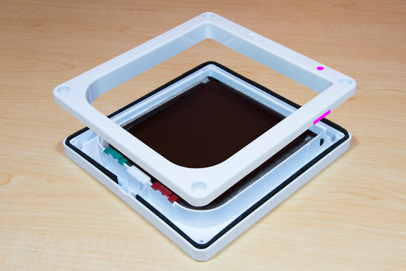
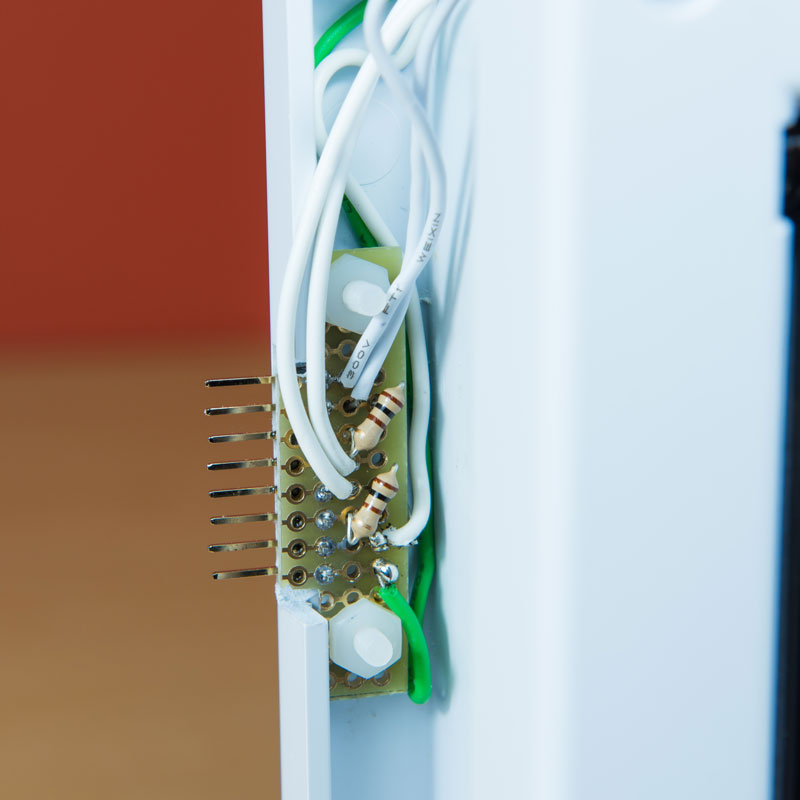
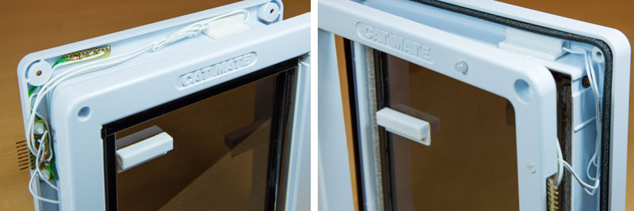
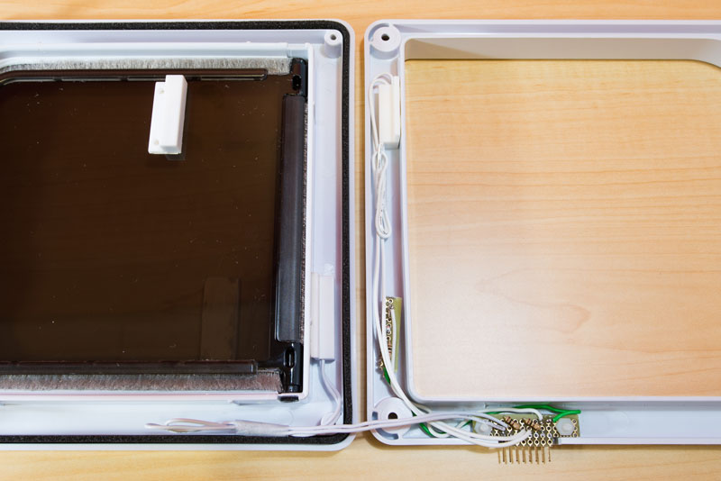

#Cat Door

Connect Kinoma Element and sensors to a cat door to keep track of your pet’s activity.

---

AT A GLANCE

Project: Cat Door

Difficulty: Easy

Time: 3-4 hour

---

#Overview

This simple project can track a cat's in-and-out activity using an off-the-shelf cat door, Kinoma Element, a basic LED, and two sets of magnetic reed sensors. The optional mobile companion app, also built with KinomaJS, tells you where your cat currently is and keeps track of how much time your cat spends outside.

This project was showcased at SXSW and Maker Faire Bay Area 2016, and it was a hit! Several cat-owning attendees requested a tutorial so they can make their own, so here it is.

If you get stuck along the way, try getting help from the Kinoma Element Forum.tutorial so they can make their own, so here it is.

See a video demonstration of this project [here](https://youtu.be/RxnZjcDA9Pk).

<!--
<iframe width="700" height="415" src="https://www.youtube.com/embed/RxnZjcDA9Pk?rel=0&amp;controls=0&amp;showinfo=0" frameborder="0" allowfullscreen></iframe>
-->

## Parts List

1. Kinoma Element
2. Cat door (we used the [Cat Mate 4 Way Locking Cat Flap](https://www.amazon.com/Cat-Mate-Locking-Flap-White/dp/B001UKX484))
3. [Magnetic contact switch set](https://www.sparkfun.com/products/13247) (x2)
4. [100 ohm resistors](https://www.sparkfun.com/products/13761) (x3)
5. [Basic LED](https://www.sparkfun.com/products/531)
6. Standard 0.1" 1x8 header
7. Protoboard

##1 Cat door design

The magnetic switch set contains a reed switch piece and a magnet piece. When the magnet piece comes within 20mm of the reed switch piece, the circuit will be completed and the movement is captured.



We need to use two sets of magnetic switches to capture the movement of the door flap in each direction. This makes it easy to trace the direction the door flap swings and therefore determine whether the cat has gone in or out.



The two reed switch pieces are installed on the frame. They should be above the flap and on opposite sides. The magnet pieces are attached to the flap, also on opposite sides. When the flap swings up, they need to be close enough to trigger the reed switch. It may take a few test runs to figure out exactly where they should be.

##2 Wiring

The reed switch needs a pull-down resistor (100 ohm) connected to ground.



We add an LED to show the current status of the cat. When the cat goes out of the house, the LED will be turned on. When it returns, the LED will be turned off. The LED also needs a pull-down resistor.



The diagram below shows the wiring we used. We soldered the 1x8 header onto a small piece of protoboard that fits inside the door and connects to both magnetic reed switches and the LED.



Before putting everything together. We need to drill a hole for the LED light and cut an opening for the headers on the door. The suggested location of both is highlighted in pink on the picture below.



Use the following pictures as reference to complete the sensor installation.








##3 Kinoma Element app

The Kinoma Element app consists of just two files:

- **main.js**: the application file
- **catdoor.js**: the BLL that interacts with the magnetic reed sensors and LED

Most of the code in **main.js** is just configuring the pins using the [Pins module](http://kinoma.com/develop/documentation/element-pins-module/). Here we specify that we want to use the BLL **catdoor.js** and all the pins it uses.

```
Pins.configure({
    catdoor: {
        require: "catdoor",
        pins: {
		    outPower: { pin: 9, type: 'Power' },
		    switchOut: { pin: 10, type: 'Digital', direction: 'input' },
		    outGround: { pin: 11, type: 'Ground' },
		    inPower: { pin: 12, type: 'Power' },
		    switchIn: { pin: 13, type: 'Digital', direction: 'input' },
		    inGround: { pin: 14, type: 'Ground' },
		    light: { pin: 15, type: 'Digital', direction: 'output' },
		    lightGround: { pin: 16, type: 'Ground' }
        }
    },
}, 
...
```

Once configured, we call `Pins.share`, which will allow other devices to discover this application and make remote calls to the BLL.

```
Pins.share("ws", {zeroconf: true, name: "element-catdoor"});
```

The next line calls the `updateStatus` function in **catdoor.js** every 100ms. 

```
Pins.repeat('/catdoor/updateStatus', 100);
```

The BLL keeps track of the cat's location in a variable called **currState**. The `updateStatus` function checks if either switch is high, then changes the **currState** variable and toggles the light on/off accordingly.

```
if ( this.switchOut.read() ) {
	currState = CAT_OUT;
	this.light.write( 1 );
} else if ( this.switchIn.read() ) {
	currState = CAT_IN;
	this.light.write( 0 );
}
```

##4 Companion mobile app

Much of the companion mobile app code is defining the UI. See the [KinomaJS tutorials](http://kinoma.com/develop/documentation/kinomajs-tutorials/) for in depth explanations of building user interfaces using the KinomaJS containment hierarchy.

The `onLaunch` function of the application's behavior contains the code that discovers the Kinoma Element application and calls the `checkCatStatus` function of the BLL. This function returns 1 if the cat last came in and 0 if the cat last went out,

```
Pins.discover(function(connectionDesc) {
	trace("Found: " + JSON.stringify(connectionDesc) + "\n");
	if (connectionDesc.name == "element-catdoor") {
		application.remove(transparentOverlay);
		wsPins = Pins.connect(connectionDesc);
		let catIn = true;	
	   	wsPins.repeat('/catdoor/checkCatStatus', 200, result => {
	    	if ((result) && (!catIn)) {
	    		catIn = true;
	    		application.distribute("doorIn")
	    	} else if ((!result) && (catIn)) {
	    		catIn = false;
	    		application.distribute("doorOut");
	    	}
		});	
	}
}, ...
```

##5 Finish

Once you've wired everything up, run the [element-catdoor sample application](https://github.com/Kinoma/KPR-examples/tree/master/element-catdoor) on your Kinoma Element from Kinoma Code. The light should toggle on and off when you flip the door back and forth.

The [catdoor-companion app](https://github.com/Kinoma/KPR-examples/tree/master/catdoor-companion) can be packaged for iOS or Android devices in Kinoma Studio or by following the instructions [in the kinomajs repository README](https://github.com/Kinoma/kinomajs). It can also be run on iOS/Android mobile simulators in Kinoma Studio. It cannot be run on simulators or packaged in Kinoma Code yet, but that feature is coming soon!

#Congratulations!

You now can keep track of your pet’s activity through the cat door!