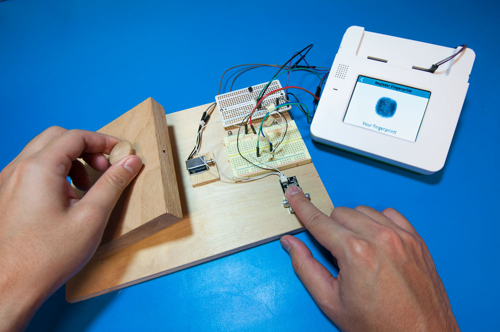
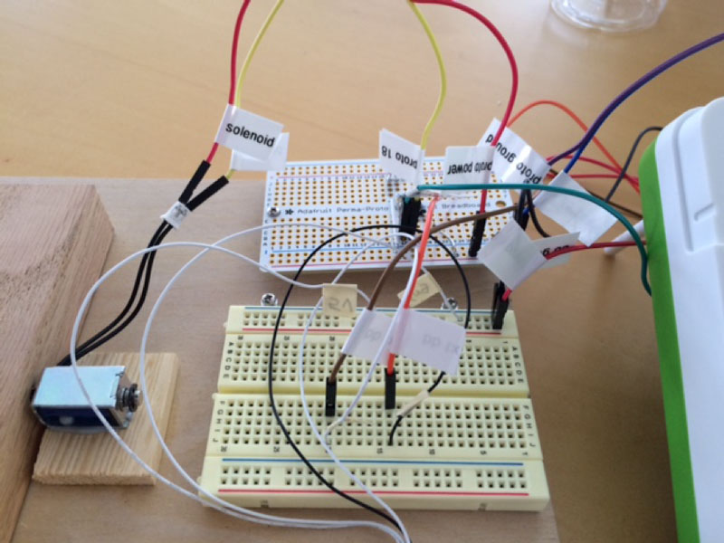
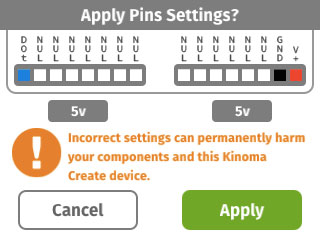
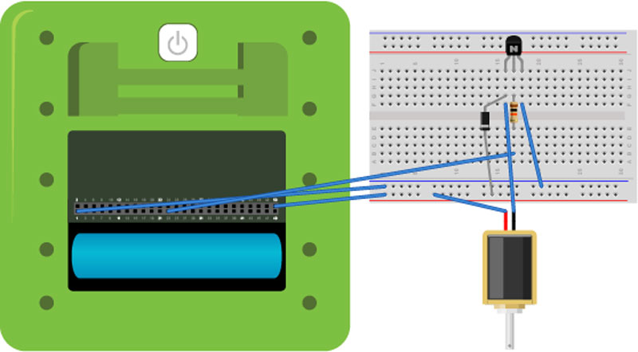
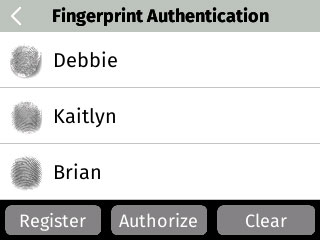
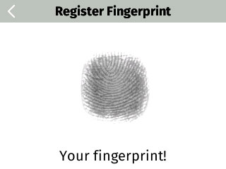

<!-- Version: 160615-CR / Primary author: Brian Friedkin / Last reviewed: June 2016 / Note: For review purposes, this file contains the text (and only the text) posted on the final web page; it does not in any way represent the formatting used on that page.
-->

#Fingerprint Lock

Use your fingerprint instead of a key to unlock a door.



---

AT A GLANCE

Project: Fingerprint Lock

Difficulty: Moderate

Time: 2 hours

---

#Overview

In this project, we build a biometric fingerprint-controlled lock prototype. A fingerprint scanner on Kinoma Create is used to capture and store the fingerprints of authorized users. When the scanner recognizes a user, a solenoid plunger disengages and opens the lock.

If you get stuck along the way, try getting help from the Kinoma Create Forum.

See a video demonstration of this project [here](https://youtu.be/OMNmsOsXZq8).

##Parts list

The fingerprint scanner module is powered by an ARM Cortex-M3 CPU, which controls the onboard optical sensor and fingerprint recognition. Fingerprints are stored and processed by the module, which supports a UART protocol for communicating with a host application. The solenoid is powered from Kinoma Create and controlled by a digital output pin.

1. Kinoma Create
2. TTL serial fingerprint scanner
3. 5V solenoid
4. Solenoid controller protoboard
5. General-purpose NPN transistor
6. Schottky-type protection diode
7. 1k ohm resistor
8. Breadboard jumper wires

##1 Wiring

The protoboard is connected to the solenoid and Kinoma Create back-header pins, and the fingerprint scanner is connected to the back-header UART TX and RX pins.



Both front pin headers are configured for +5V, and pin 51 is configured as a digital output. The application programmatically configures the front pins and displays the Pins Settings dialog.




##2 Protoboard



The solenoid used to lock and unlock the door requires three additional bits of electronics: 

- An NPN transistor. This acts as a switch for the 5V power supply from Kinoma Create, enabling us to turn on and off that current to the solenoid using our 3.3V digital output pin. 

- A Schottky-type diode. This helps protect Kinoma Create from electrical surges generated by the solenoid, dissipating flyback energy as heat through the solenoid rather than as a power spike into the Kinoma Create’s digital output pin. 

- A resistor. The value of the resistor varies depending on the transistor used and its threshold voltage.

##3 Application overview



The KinomaJS application opens to a screen that displays a list of registered fingerprints. Three buttons are provided at the bottom of the screen to interact with the scanner:

- <b>Register</b> kicks off the fingerprint capture and registration flow. Once fingerprint registration is complete, the user associates his or her name with the fingerprint using the Kinoma Create onscreen keyboard. The registered fingerprint is added to the displayed list.

- <b>Authorize</b> is used to validate a fingerprint against the list of registered users. If the fingerprint scanned matches a registered user, the door is unlocked and a success sound is played; if the fingerprint is not authorized, the door remains locked and the application plays a failure sound.

- <b>Clear</b> removes all registered fingerprints from the displayed list and clears the fingerprint scanner module storage.

##4 The code

The project includes the KinomaJS application along with the following BLLs to control the fingerprint scanner and solenoid:

- The `GT511C3.js` serial BLL controls the scanner functions, including fingerprint registration, storage, and recognition and the CMOS LED. The JavaScript implementation is based on the Windows SDK demo software provided by ADH Technology, the manufacturer of the fingerprint scanner module.

- The `solenoid.js` digital output BLL controls the door lock by engaging and disengaging the 5V solenoid.

Audible and visual feedback is provided when fingerprint authorization succeeds or fails. WAVE files are played using a KinomaJS `media` object, and PNG images are displayed using KinomaJS `texture` and `skin` objects. (Details on these or any other KinomaJS objects can be found in the *KinomaJS JavaScript Reference* document.)

The complete project, including code, assets, and BLLs, is available as `serial-fingerprint-lock` on GitHub.

##5 Fingerprint processing

The scanner module does all the work required to capture, store, and match fingerprint images. The application controls the scanner by calling functions in the `GT511C3.js` BLL. The BLL functions in turn send commands to the module via the Kinoma Create serial pins.

A fingerprint capture requires pressing and releasing the finger on the scanner three times. The fingerprint is registered and stored after the third press. The application uses a KinomaJS `behavior` object to implement a state machine that processes each of the three fingerprint scans.

To start scanning, a prompt is displayed, the LED is turned on, and the code waits for acknowledgment that the finger is pressed on the scanner.

```
this.data.PROMPT.string = "Place finger on scanner (1)";
this.finger_pressed_pending = true;
container.invoke(new MessageWithObject("pins:/fingerprint/cmos_led", 1));
container.invoke(new MessageWithObject("pins:/fingerprint/is_finger_pressed?repeat=on&interval=200&callback=/fingerPressed"));
```

The `is_finger_pressed` BLL function is called every 200 milliseconds via a repeated polling hardware pins request. The result is sent to the application's `fingerPressed` handler.

```
Handler.bind("/fingerPressed", {
   onInvoke: function(handler, message) {
      var response = message.requestObject;
      if (0 == response.parameter)
         application.distribute("onFingerPressed");
      else
         application.distribute("onFingerReleased");
   }
});
```

The handler notifies the application by distributing the `onFingerPressed` and `onFingerReleased` events to the application behavior, which in turn advances the state machine from press to capture once the finger is pressed.

```
onFingerPressed: { value: function(container) {
   ...
   switch(this.state) {
      case "press1":
         this.state = "capture1";
         break;
      case "press2":
         this.state = "capture2";
         break;
      case "press3":
         this.state = "capture3";
         break;
   }
   this.onStateChange();
}},
```

##6 Fingerprint images

The fingerprint scanner captures fingerprints to a binary template format and stores the templates in an onboard database. In addition to the fingerprint templates, the scanner provides the ability to read the raw fingerprint image. The application displays the fingerprint image on the Kinoma Create screen.



The `get_rawimage` BLL function is invoked to retrieve the raw fingerprint image from the scanner.

```
container.invoke(new MessageWithObject("pins:/fingerprint/get_rawimage"), Message.JSON);
```

The function returns an ArrayBuffer containing the 160x120 raw fingerprint image at 32 bits per pixel. The application lightens the pixels for display.


```
var width = 160;
var height = 120;
var buffer = new ArrayBuffer(width * height * 4);
var bits = new Uint8Array(buffer);
var srcIndex = 0;
var dstIndex = 0;
for (var i = 0; i < height; ++i) {
   for (var j = 0; j < width; ++j) {
      var color = (255 - (source[srcIndex++] & 0xFF)) + 100;  // lighten
      if (color > 255) color = 255;
      bits[dstIndex++] = color;
      bits[dstIndex++] = color;
      bits[dstIndex++] = color;
      bits[dstIndex++] = 0xFF;
   }
}
```

A KinomaJS `picture` object is instantiated to display the fingerprint image. Pictures can display a variety of image file formats, including PNG, JPEG, GIF, and BMP. Since the fingerprint image is just raw pixels, the application builds a BMP file in JavaScript to wrap the pixels in a format that can be displayed by the `picture` object.

```
var bmp = this.bmp = buildBMP32(bits, width, height);
var url = getBMPUrl(this.ID);
Files.writeBuffer(url, bmp);
```

The `buildBMP32` function in `bmp.js` returns an ArrayBuffer containing an in-memory BMP file of the fingerprint image.

```  
var buildBMP32 = function(bits, width, height) {
   var bmpSize = 14 + 40;
   var buffer = new ArrayBuffer(bmpSize + bits.byteLength);
   var bmp = new Uint8Array(buffer);

   // File header
   bmp[0] = 0x42;                        // imageFileType
   bmp[1] = 0x4D;
   setLittleEndian32(bmp, 2, bmpSize + bits.byteLength);  // fileSize
   setLittleEndian16(bmp, 6, 0);         // reserved1
   setLittleEndian16(bmp, 8, 0);         // reserved2
   setLittleEndian32(bmp, 10, bmpSize);  // imageDataOffset

   // BITMAPINFOHEADER
   setLittleEndian32(bmp, 14, 40);       // biSize
   setLittleEndian32(bmp, 18, width);    // biWidth
   setLittleEndian32(bmp, 22, height);   // biHeight
   setLittleEndian16(bmp, 26, 1);        // biPlanes
   setLittleEndian16(bmp, 28, 32);       // biBitCount
   setLittleEndian32(bmp, 30, 0);        // biCompression
   setLittleEndian32(bmp, 34, 0);        // biSizeImage
   setLittleEndian32(bmp, 38, 0);        // biXPelsPerMeter
   setLittleEndian32(bmp, 42, 0);        // biYPelsPerMeter
   setLittleEndian32(bmp, 46, 0);        // biClrUsed
   setLittleEndian32(bmp, 50, 0);        // biClrImportant

   // Image pixels
   bmp.set(bits, bmpSize);

   return bmp.buffer;
}
```

The `getBMPUrl` function in `main.js` constructs and returns a `file://` URL for saving the in-memory BMP image to a BMP image file.

```
var getBMPUrl = function(id) {
   var url = mergeURI(Files.documentsDirectory, "fingerprint" + id + ".bmp");
   return url;
}
```

Finally, the application instantiates a `FingerprintPicture` template to display the fingerprint BMP image file. Since the raw image is rotated sideways, the `picture` object's behavior rotates the image 90 degrees about the center for display.

```
container.replace(container.first.next, new FingerprintPicture(url));
 
var FingerprintPicture = Picture.template(function($) { return {
   width: 160, height: 120,
   behavior: Object.create(Behavior.prototype, {
      onCreate: { value: function(picture, url) {
         picture.load(url);
      }},
      onLoaded: { value: function(picture) {
         picture.origin = {x: picture.width/2, y: picture.height/2};
         picture.rotation = 90;
      }},
   })
}});
```

The fingerprint list, including references to the saved fingerprint image files, is stored in JSON format in a preferences file.

```
model.writePreferences(application, "fingerprints", model.data.items);
```

The preferences file is read at application launch and included in the instantiating data used to build and display the list.

```
onLaunch: { value: function(application) {
   this.data = {
      keyboard: {
         title: "Register Fingerprint",
         okLabel: "OK",
         cancelLabel: "Cancel",
         previousText: "",
         keyboard: KEYBOARD.standardKeyboard,
         hintText: "Enter a title for the fingerprint",
      },
      title: "Fingerprint Authentication",
      items: this.readPreferences(application, "fingerprints", []),
      more: false,
      id: -1
   };
   ...
}
```

##7 Finish

Once the prototype is wired up, simply run the [serial-fingerprint-lock](https://github.com/Kinoma/KPR-examples/tree/master/serial-fingerprint-lock) sample application from Kinoma Code. Enjoy!

This project--always a crowd-pleaser--was demonstrated in 2015 at SXSW Interactive, Maker Faire Bay Area, and World Maker Faire New York.

#Congratulations!

You have succeeded in building a biometric fingerprint-controlled lock prototype!