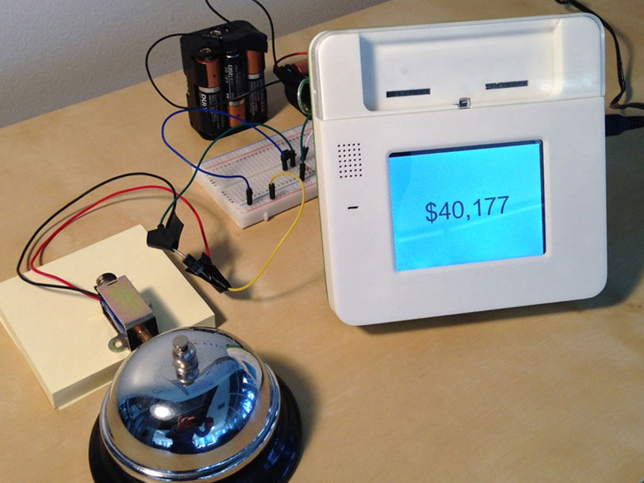
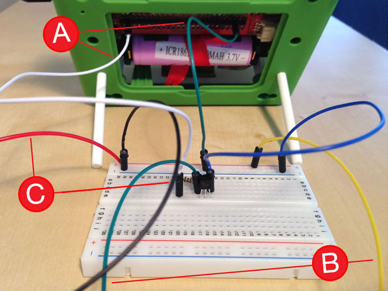
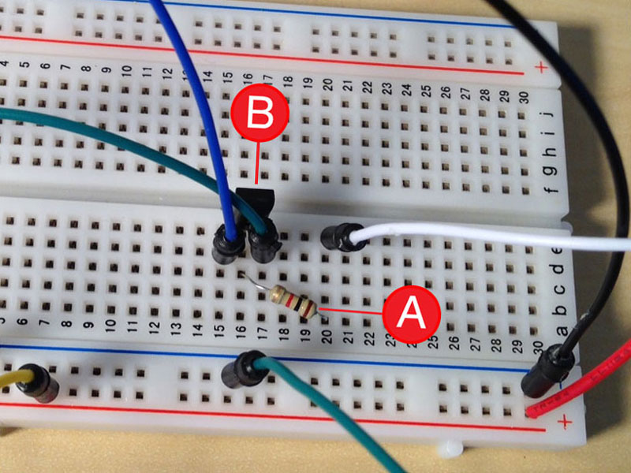
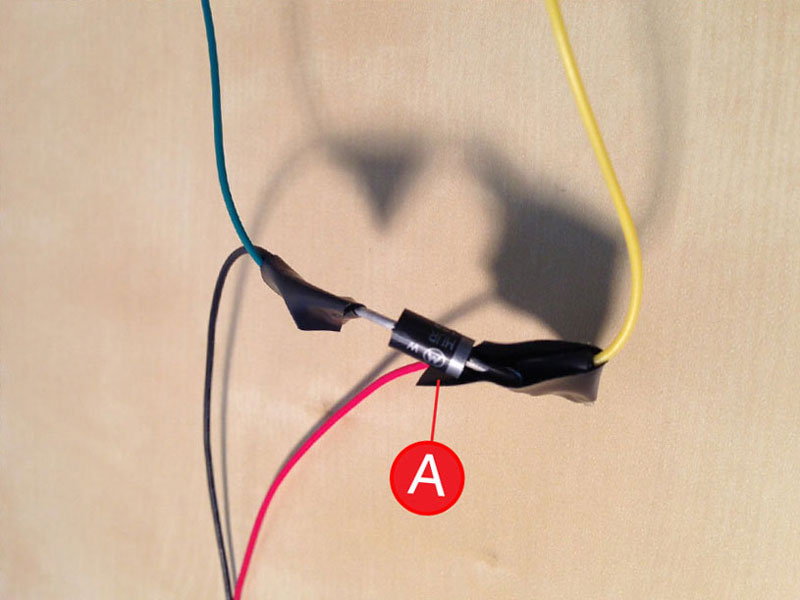
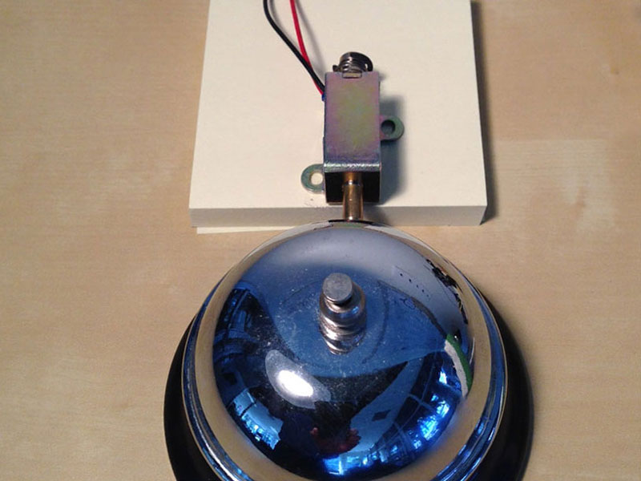

<!-- Version: 160616a-CR / Primary author: ? / Last reviewed: Old project, no longer being reviewed
-->


#Ringer

Ring a bell as an Indiegogo contribution monitor.



---

AT A GLANCE

Project: Ringer

Difficulty: Moderate

Time: 8-10 hours

---

#Overview

We built a monitor that rang a bell every time a new person supported Kinoma's Indiegogo campaign and purchased a Kinoma Create device. In this project, Kinoma Create runs an app that scrapes the Indiegogo campaign page periodically and displays the total amount contributed. When new contributions are made, it physically rings a bell by striking it with a solenoid. 

<b>Note:</b> The Kinoma Create Indiegogo campaign has been closed, and the source code for this project is no longer available for downloading; only snippets are shown here. If you are interested in getting the full source, you can post an inquiry on the Kinoma Create Forum or send an email to developer@kinoma.com.

 
##Parts list

For this project, we need a solenoid to ring the bell, batteries to provide a high-voltage power supply to the solenoid, a protection diode to keep our batteries and the Kinoma Create safe from the kickback of the solenoid, and a transistor to allow the Kinoma Create to switch the high-voltage power on and off. Beyond that, we just need some breadboard jumpers, a resistor, and a breadboard to stitch it all together.

1. Kinoma Create
2. Breadboard
3. Breadboard jumper wires
4. 12-14 AA batteries and battery holders (something like this would do, though you would need two)
5. General-purpose NPN transistor (we use a BC337)
6. Schottky-type protection diode (we use a MUR420)
7. 1k ohm resistor
8. 24V solenoid
9. Desk bell
10. Post-it Notes

##1 Breadboard wiring

We start by wiring everything up. The connections to and from the Kinoma Create are very simple: one GPIO pin to drive our transistor “switch” and one ground that will be tied to the battery pack ground. We bring the + and – sides of the solenoid assembly (discussed below) back to the breadboard. Finally, two jumpers connect the battery pack to the power rails of the breadboard.



* (<b>A</b>) The white jumper connects a Kinoma Create GPIO to the breadboard. The green jumper is a ground.

* (<b>B</b>) The yellow jumper connects our high-voltage power supply to the protection diode/solenoid assembly. The green jumper is the ground side of the protection diode/solenoid assembly.

* (<b>C</b>) The red and black jumpers connect the power and ground from our high voltage power supply to the breadboard.

##2 Breadboard components

We need two components on the breadboard: a transistor (<b>B</b>) that acts as a switch, allowing Kinoma Create to turn on and off the high-voltage power supply to the solenoid, and a 1k ohm resistor (<b>A</b>) to limit draw along the path from Kinoma Create's GPIO to ground.



The connections are:

* GPIO from the Kinoma Create to the 1k ohm resistor to the base leg of the transistor

* The emitter leg of the transistor to the ground rail of the breadboard (common ground between the battery pack and the Kinoma Create)

* The collector leg of the transistor to the ground side of the protection diode/solenoid assembly

##3 Protection diode

We need a protection diode to prevent unexpected consequences from the kickbase phase of our solenoid. It is best to use a fast-responding Schottky-type diode for this purpose. The cathode side of the diode (with the gray marker) connects to the high-voltage power supply from our breadboard and the + side of the solenoid. The anode side of the diode connects to the collector leg of our transistor and the – side of the solenoid. 



Being the rough-and-tumble prototypers that we are (and because our soldering iron was stuck in a crate being shipped back from SXSW), we combined the components and jumpers using electrical tape.

##4 Additional power for solenoid

We use a high-voltage solenoid to get a nice, crisp ring out of our bell. Kinoma Create (like most platforms) can output a maximum of 5V--plenty for most purposes, but not nearly enough here, so we build a high-voltage power supply from AA batteries--16 AAs wired in series, for a total output of roughly 24V. More electrical tape keeps everything together.


##5 Solenoid and bell

The last major challenge is to get the solenoid to strike the bell in a satisfactory manner. We achieve the desired effect by elevating the solenoid on a stack of Post-it Notes and positioning it about 4mm from the bell. The solenoid, the bell, and the Post-it stack are all affixed with double-sided Scotch tape.



##6 Code snippets

There are two particularly interesting aspects of the application code. The first is what we use to ring the bell: a short script that is invoked every time the main application detects that a new contribution has been made to the campaign.

```
for (var i = 0; i < parameters.times; i++) {
    gpio.set([4], 1);
    sensorUtils.mdelay(50);
    gpio.set([4], 0);
    sensorUtils.delay(2);
}
```

Note from this snippet that:

* These scripts can be parameterized. Here we use a parameter to specify how many times in a row to ring the bell. 

* Setting GPIO pins is simple: just specify an array of the pins to be set and a value. 

* We can delay execution of the script to achieve useful effects (in this case, waiting for the solenoid to extend before allowing it to bounce back). These delays have no impact on the rest of our application; they are local to this script.

Also interesting is the following snippet--the handler that fetches and parses the Indiegogo campaign page. When invoked, it invokes a message to request the web page. When that completes, we look for a regular expression to find the current contribution total for the campaign.

```
<handler path="/getIGG">
   <behavior>
      <method id="onInvoke" params="handler, message"><![CDATA[
         var msg = new Message( "http://www.indiegogo.com/projects/kinoma-create" );
         handler.invoke( msg, Message.TEXT );
      ]]></method>
      <method id="onComplete" params="handler, message, text"><![CDATA[
         var totalRegex = /<span>\$([0-9]*,[0-9]*)<.span><em>USD/;
         var dollarsMatch = totalRegex.exec(text);
         var dollars = dollarsMatch[1].replace(/\,/g,'');
         dollars = parseInt( dollars, 10 );
         data.cash.string = " " + "$" + dollarsMatch[1] + " ";
         var times = 0;
         if ( dollars > oldData ){
            times = Math.ceil( ( dollars - oldData ) / 109 ); // Ring the bell once for every new contribution
            oldData = dollars;
            handler.invoke( new Message( "/ringBell?times=" + times ) );
         }
      ]]></method>
   </behavior>
</handler>
```

#Congratulations!

You have learned how to build a monitor that rings a bell every time a new person supports an Indiegogo campaign!