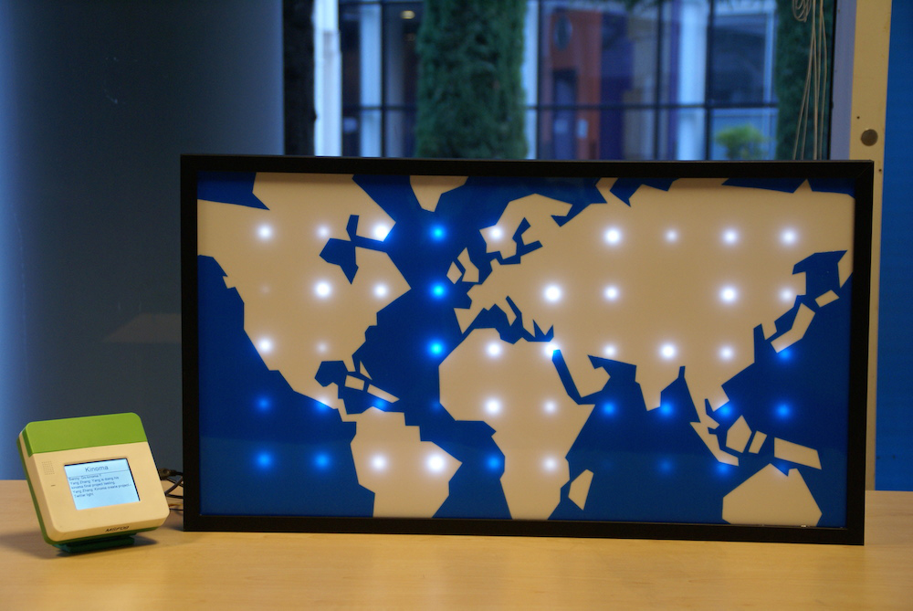
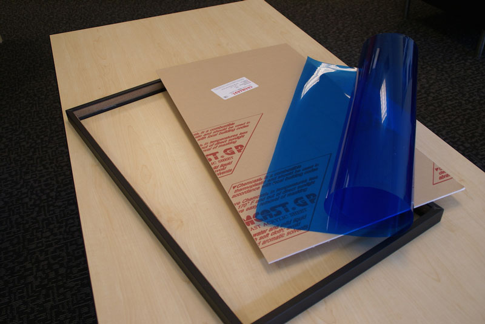
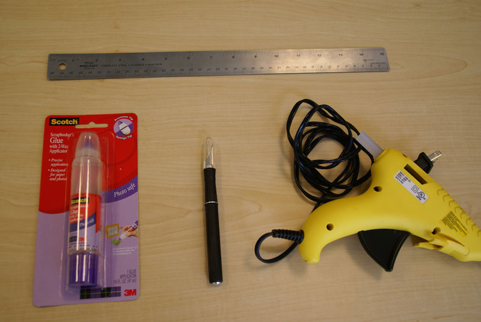
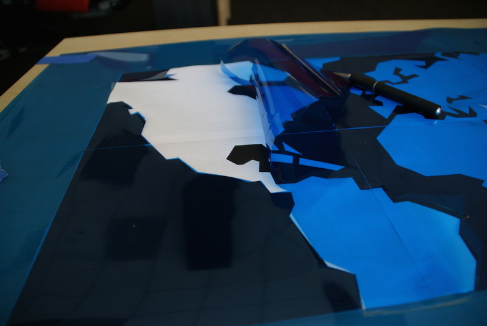
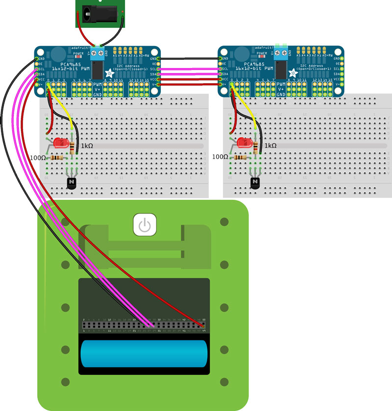
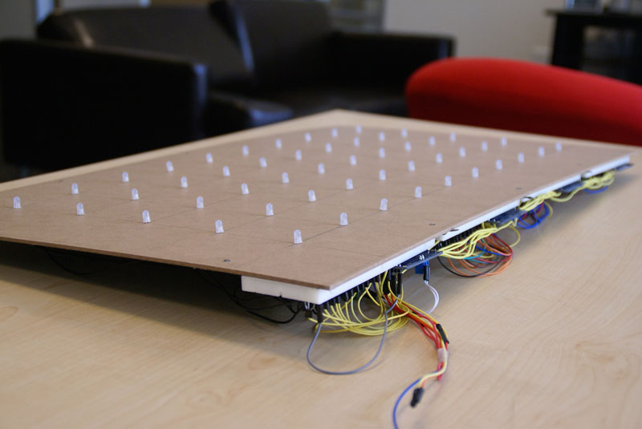
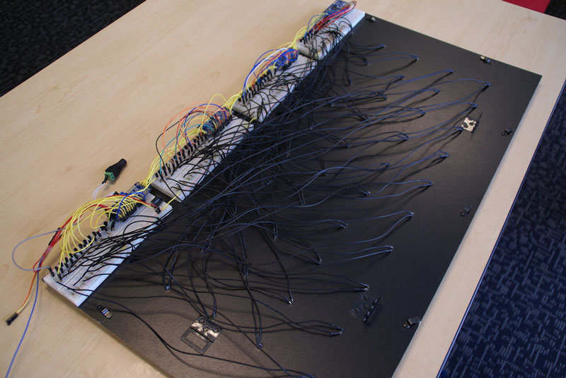

<!-- Version: 160616a-CR / Primary author: ? / Last reviewed: Old project, no longer being reviewed
-->

#Sparkle Motion

Create an LED world map driven by global Twitter traffic data. 



---
AT A GLANCE

Project: Sparkle Motion

Difficulty: Moderate

Time: 8-10 hours

---

# Overview

This project illustrates how to control an array of LEDs, use OAuth-based services, and more. We build a light that changes its flicker behavior by monitoring global Twitter traffic. Fifty LEDs are embedded behind a large, translucent white acrylic board to form a map of the world, with a blue vinyl film glued onto the board. This map serves as a low-res display for illustrating global Twitter traffic.

Tweets containing a specific keyword trigger a ripple on the map based on their geological locations. The overall brightness of the map indicates the Twitter traffic load, and areas with more Twitter traffic are brighter than others. User can type in the keyword using Kinoma Create’s touch screen, and tweets containing the keyword are shown on the screen in real time.

<b>Note:</b> The source code for this older project is no longer available for downloading; only snippets are shown here. If you are interested in getting the full source, you can post an inquiry on the Kinoma Create Forum or send an email to developer@kinoma.com.

## Parts list

For this project, we need PWM driver breakouts to enable Kinoma Create to control 50 LEDs in the PWM manner. Transistors are used to drive the LEDs with a separate power supply.

1. Kinoma Create
2. 16-channel 12-bit PWM driver (x4)
3. General-purpose NPN transistors (x50)
4. 5mm LEDs (x50)
5. DC barrel jack adapter (female)
6. 5V power supply
7. 100 ohm resistors (x50)
8. 1k ohm resistors (x50)
9. Breadboard
10. Breadboard jumper wires
11. 28" × 15" × 0.125" translucent white acrylic sheet
12. Blue vinyl film
13. Photo frame

##1 Code snippets

To poll the tweets stream, we use the `handler.download` method to set up a socket. Whenever the tweet data is received, the data is passed as chunks to the `onReceive` method. HTTP requests are authorized by `accessToken`, which we hard-code as variables.

```
<handler path="/twitter/pollStream">
   <behavior like="MODEL.CommandBehavior"><![CDATA[
      function onQuery(handler, query) {

         // Send HTTP GET request to set up socket for tweets stream
         var message = new Message(url+keyword);
         message.method = "GET";

         // Authorize the request by access token
         authorizer.authorize(message, accessToken);
         handler.download(message);
         global_message = message;
      }
```

The label shown on the top of the screen is for typing in the keyword. When the label is touched, a keyboard will pop up. A transition is used to switch between `mainScreen` and `keyboardScreen`.

```
<container left="2" top="2" right="2" height="60" skin="blackSkin">
   <label anchor="KEYWORD" left="2" top="2" right="2" height="56"
      style="labelStyle" active="true" string="$.searchTerm" skin="whiteSkin">
      <behavior>
         <method id="onCreate" params="container, data, context">
            <![CDATA[
               this.data = data;
            ]]>
         </method>
         <method id="onTouchBegan" params="label, id, x, y, ticks">
            <![CDATA[
               keyboardScreen = new MyKeyboardScreen(data);
               application.run( new TRANSITIONS.TimeTravel(), mainScreen, keyboardScreen,
                  { direction : "forward", easeType : "sineEaseOut", duration : 500,
                  xOrigin : 160, yOrigin : 92 } );
            ]]>
         </method>
      </behavior>
   </label>
</container>
```

The `onChanged` method runs a one-shot BLL call to set all LEDs according to the values of elements stored in `value_array`. 0x40, 0x41, 0x42 and 0x43 are the addresses of the chained PWM breakouts. The `setPWM` function in the BLL library uses I<sup>2</sup>C communication to update registers in the breakouts in order to change the output and control the brightness of the LEDs.

```
<method id="onChanged" params="container, changed_data"><![CDATA[
   // Run a one-shot BLL call to set all LEDs
   var message2 = new Message( "xkpr://shell/pins/run?" + serializeQuery( {
      require: "PCA9685_BLL",
      call: "setPWM",
   } ) );

   message2.requestObject = { ap:AMP, addr:[0x40,0x41,0x42,0x43], brightness:value_array};
   application.invoke( message2 );
]]></method>
```

##2 Materials and tools preparation

The materials we need are a frame, the acrylic sheet, and the transparent blue vinyl film. The tools we use are a nicking tool, a bottle of liquid glue, a hot glue gun, and a ruler.





##3 Cutting the world map

We print the world map and cut the vinyl film according to the map. In this design, we cut the continents out and leave the oceans on the map. After that, we glue the blue vinyl film onto the acrylic sheet.




##4 LED wiring

Insert all 50 LEDs into the back of the frame and wire them according to the schematic diagram below. Each PWM driver can control up to 15 LEDs, so we use four drivers to cover all 50 (12, 12, 12, and 14). Here we illustrate how one of the LEDs would be wired on one column of the driver and how you can chain the drivers together. We show only two drivers in the illustration, but remember that there are four in our real implementation.







##5 Finish

After completing the steps above, we assemble all the parts together and upload the program to the Kinoma Create. 

#Congratulations!

You now have lights monitoring the entire Twitter world!