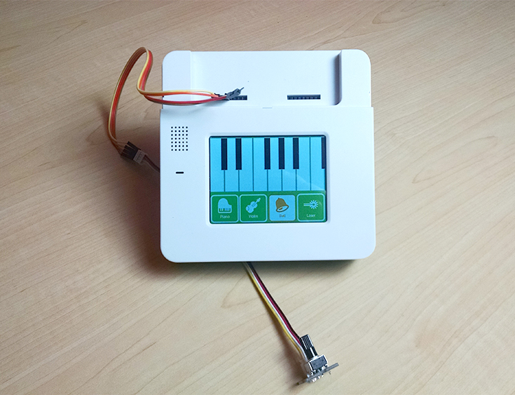
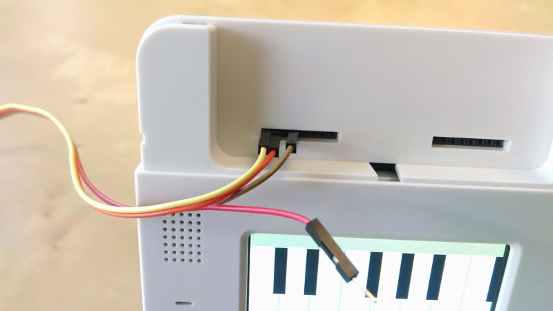
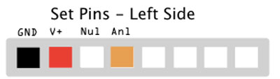
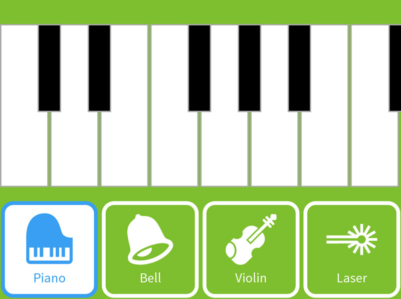
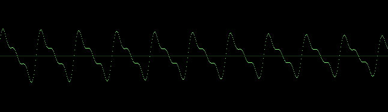

<!-- Version: 160616a-CR / Primary author: Brook Nichols / Last reviewed: June 2016
-->


#Synthesizer

Build a keyboard UI with five sound synthesis modes.



---

AT A GLANCE

Project: Synthesizer

Difficulty: Easy

Time: 1 hour

---

#Overview

Here we build a keyboard UI with five synthesis modes all in JavaScript, to show the power of using Kinoma Create's audio output hardware pin. As discussed in the Tech Note Playing Audio with KinomaJS, using the audio output hardware pin is the most flexible--and the most complex--way to play sounds from Kinoma Create. This simple example will serve as a good starting point.

See a video demonstration of this project [here](https://youtu.be/WJbplCZTUTI).


## Parts list

You can run this project using the Create simulator in Kinoma Code; however, to build it physically or make any additional modifications, you will need the actual parts. Here we use the Grove Rotary Angle Sensor, but any potentiometer or analog input will do.

1. Kinoma Create
2. Grove Rotary Angle Sensor
3. Breadboard jumper wires (M/M)

##1 Wiring

The wiring is trivial: simply connect the ground, power, and analog input to the front pins.



In the program, the analog input is set to pin 54. You can use the Front Pins app to configure it like so:



##2 The code

This project adds to the original `synthOut.js` BLL with synthesizer functions for additional sound modes. For analog input support, it also includes the `analog.js` BLL and pin simulator runtime. Additionally, it has an asset (`synthiconsborder.png`), which is used as a texture to create the application UI.

The complete project, including code, assets, and BLLs, is available on GitHub.

##3 UI templating

We use a texture for the mode selection UI. The code for the skin of the texture is as follows:

```
var SynthTexture = new Texture("./assets/synthiconsborder.png");
var SynthStates = new Skin({ texture: SynthTexture, x: 0, y: 0, width: 80, height: 80, states: 80, variants: 80 });
```

This sets the variants and states of the skin, which are then applied to the button content. Each button is instantiated by the content template.

```
var SynthButton = Content.template(function($) { return {
   top: 0, width: 78, height: 78, skin: SynthStates, variant: $, state: "OFF", 
   behavior: Behavior({
      onCreate: function(container, data) {
         this.name = data;
      },
   }),
}});
```

These buttons are then contained within a button container and instantiated by the container.

```
var ButtonTray = Container.template(function($) { return {
   left: 0, right: 0, top: 160, bottom: 0, active: true, 
   behavior: Behavior({...
   ...
   contents: $.map(function(name, index) {
      return new SynthButton(name, {left: index*80});
   }),
}})
``` 

The button container is instantiated as follows:

```
application.add(new ButtonTray([0, 1, 2, 3]));
```

The keys and keyboard are instantiated as shown below. These use solid skins.

```
// White keys template
var Key = Content.template(function($) { return {
   top: 20, width: 38, height: 130, skin: KeySkin,
   behavior: Behavior({
      onCreate: function(container, data) {
         this.frequency = data;
      },
   }),
}});

// Black keys template
var HalfKey = Content.template(function($) { return {
   top: 2, width: 18, height: 90, skin: HalfKeySkin,
   behavior: Behavior({
      onCreate: function(container, data) {
         this.frequency = data;
      }, 
   }),
}});

var Keyboard = Container.template(function($) { return {
   left: 0, right: 0, top: 0, bottom: 0, active: true, multipleTouch: true, 
   skin: KeyBoardSkin,
   behavior: Behavior({ ...

   ...

   contents: $.map(function(frequency, index) {
      if (index < 8) 
         return new Key(frequency, { left: index * 40 });
      else if (index < 10) 
         return new HalfKey(frequency, { left: 30 + (index-8) * 40 });
      else if (index < 13)
         return new HalfKey(frequency, { left: 150 + (index-10) * 40 });
      else return new HalfKey(frequency, { left: 310 });
   }),
}});
```

All of these elements also have behaviors associated with them. The hit testing for the buttons is configured using the `hitTouch` method in a container and is fairly straightforward.

```
// Determines current touch index, compares to current, switches modes accordingly
hitTouch: function(container, id, current) {
   var former = this.touches;
   if (former != current && current != -1) {
      if (former >= 0)
         container.content(former).state = 0;
      if (current >= 0)
         container.content(current).state = 1;
         if (current == 0) synthoption = "";
         if (current == 1) synthoption = "violin";
         if (current == 2) synthoption = "bell";
         if (current == 3) synthoption = "laser";
      this.touches = current;
   }	
},
```



##4 Sound synthesis

The article Creating sound waves with JavaScript by Rodrigo Siqueira is a good resource for finding out what functions produce what kinds of sound. Keep in mind that Kinoma Create’s sampling rate will be 4-8 kHz and will support only about three to five different tones at once. If you examine the synthesizer functions in `synthOut.js`, you can see how the different synthesizer modes are being created. In this project, the sampling rate is set to 4 kHz in `main.js` as follows:

```
application.behavior = Behavior({
   onLaunch: function(application, message) {
      Pins.configure({
         audio: {
            require: "synthOut",
            pins: {
               /* Lowered sampleRate from 8 kHz to 4 kHz, to allow for more 
                  simultaneous tones (to support synth modes). You get ~5 at 4 kHz, 
                  and ~3 at 8 kHz.*/
               speaker: {sampleRate: 4000, amplitude: aval}
            },
         },
```

This supports five tones but is poorer sound quality than an 8 kHz sampling rate. However, at that rate only three tones are supported at once, so the violin synth mode ceases to operate properly.

```
// Violin tone function. Uses descending harmonics, and oscillation for vibrato effect.  
samples[i++] = ( Math.sin(time) + .5 * Math.sin(time*2) + 1/3*Math.sin(time*3) ) 
   * amplitude * (1-Math.exp(-((time/step))*0.00075/* 3/4000 */)) 
   * (1-0.5*Math.sin(0.00942477796/* 2*Math.PI*6/4000 */*(time/step)));
```

As you can see, the violin mode adds different wave forms together. At an 8 kHz sampling rate, this calculation requires too much CPU for Kinoma Create to handle in real time.



##5 The analog input

The analog input part is included to show how simple it is to include a hardware input and affect the operations of some other piece of hardware, such as the audio output. If you do not have a Kinoma Create or potentiometer handy, you can use the device/analog simulator to see how it behaves. In this project, we have the analog input adjusting the output amplitude (volume); however, you could easily change it to adjust the frequency output as well, or do something else, alongside the sound creation.

```
application.behavior = Behavior({
   onLaunch: function(application, message) {
      Pins.configure({
         ...
         analogSensor: {
            require: "Analog",
            pins: {
               analog: { pin: 54 }
            }
         },	    
```

Once the analog pin is configured, the application polls the analog input every 20 milliseconds.

```
/* Use the initialized analogSensor object and repeatedly 
	call its read method with a given interval (20ms). */
Pins.repeat("/analogSensor/read", 20, result =>
   application.distribute("onAnalogValueChanged", result));
```

Then the callback is bound, and inside the keyboard container we set the amplitude of the synthesizer.

```
// Keyboard container template
var Keyboard = Container.template(function($) { return {
   left: 0, right: 0, top: 0, bottom: 0, active: true, multipleTouch: true,
   skin: keyBoardSkin,
   behavior: Behavior({ ...
      ...
      onAnalogValueChanged: function(container, result) {
         // Function defines how analog value (0-1) changes audio amplitude (loudness)
         var test = (2*result+.5) * aval;
         // Change amplitude with analog input values 
         Pins.invoke("/audio/setAmplitude", test);
      },
   ...
}});
```

##6 Finish

Simply run the [simplesynth sample app](https://github.com/Kinoma/KPR-examples/tree/master/simplesynth) on your device to start the synthesizer program. If you are running in a simulator, you can adjust the analog input as desired. If running on Kinoma Create, you need the potentiometer attached and set up to hear the sound correctly.

#Congratulations!

You have succeeded in building a keyboard UI with five sound synthesis modes!